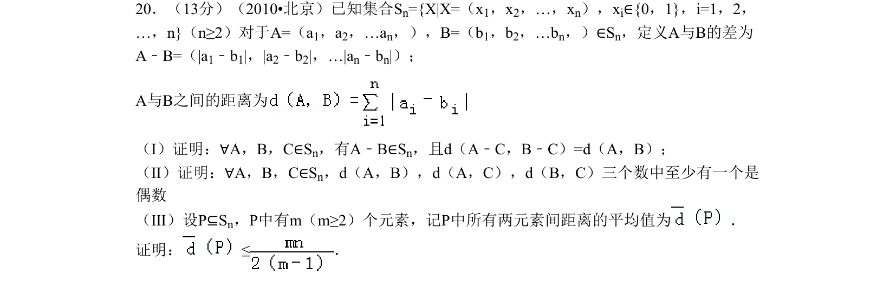
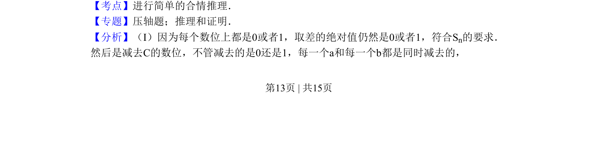
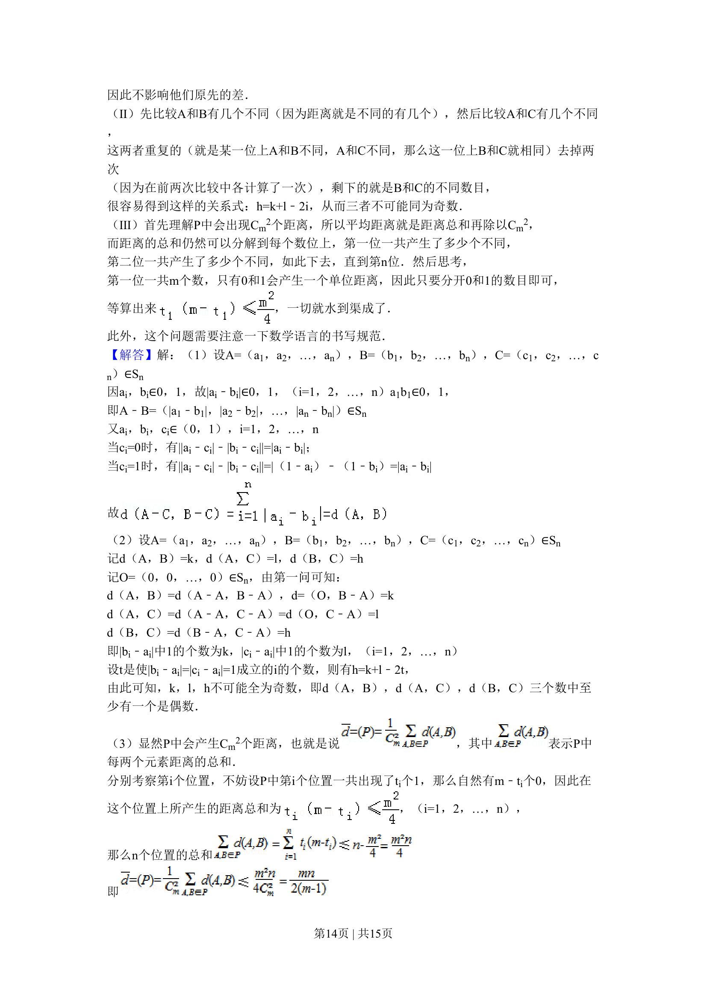
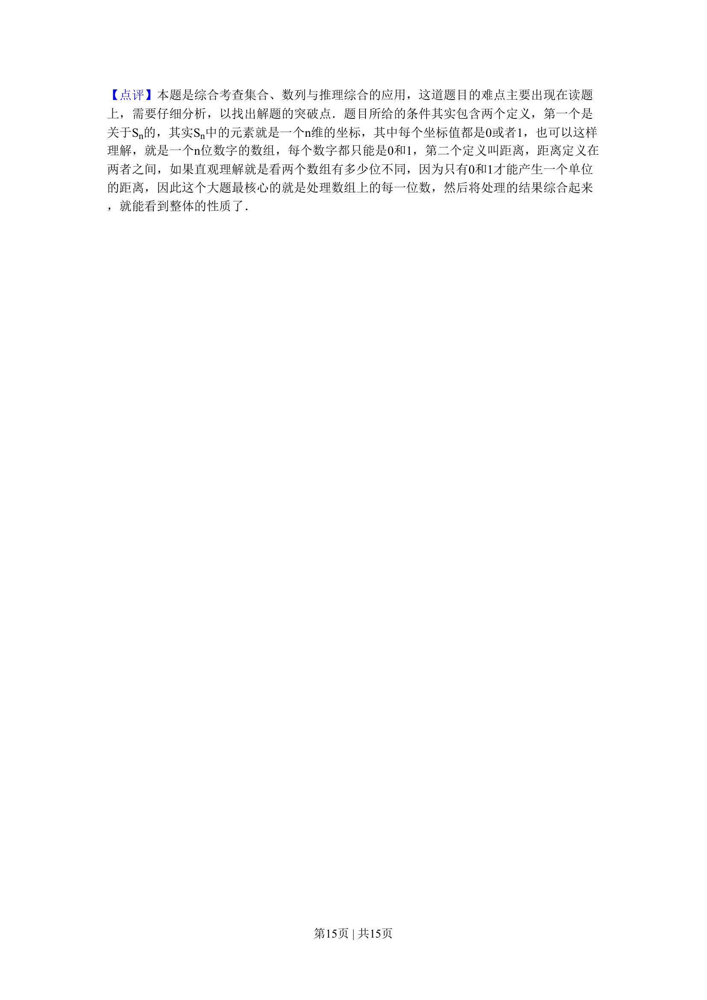

## 题面

## 摘要

该题考查基于0-1序列定义的集合Sn的差和距离运算，证明相关性质并估计子集平均距离的上界。

## 关联考点

- [[740-合情推理|合情推理]]
- [[距离公理]]
- [[1377-奇偶性分析|奇偶性分析]]
- [[平均值估计]]

## 答案与解析

> 📄 原 PDF 第 13 页：`素材/真题/北京/2008-2024·（北京）数学高考真题/2010年高考数学试卷（理）（北京）（解析卷）.pdf`

<!-- 题干文本-start -->
## 题干文本
20．（13分）（2010•北京）已知集合Sn={X|X=（x1，x2，…，xn），xi∈{0，1}，i=1，2，
…，n}（n≥2）对于A=（a1，a2，…an，），B=（b1，b2，…bn，）∈Sn，定义A与B的差为
A﹣B=（|a1﹣b1|，|a2﹣b2|，…|an﹣bn|）；
A与B之间的距离为
（Ⅰ）证明：∀A，B，C∈Sn，有A﹣B∈Sn，且d（A﹣C，B﹣C）=d（A，B）；
（Ⅱ）证明：∀A，B，C∈Sn，d（A，B），d（A，C），d（B，C）三个数中至少有一个是
偶数
（Ⅲ）设P⊆Sn，P中有m（m≥2）个元素，记P中所有两元素间距离的平均值为 ．
证明：≤．
<!-- 题干文本-end -->

<!-- 解析文本-start -->
## 解析文本
【考点】进行简单的合情推理．菁优网版权所有
【专题】压轴题；推理和证明．
【分析】（Ⅰ）因为每个数位上都是0或者1，取差的绝对值仍然是0或者1，符合Sn的要求．
然后是减去C的数位，不管减去的是0还是1，每一个a和每一个b都是同时减去的，
<!-- 解析文本-end -->
