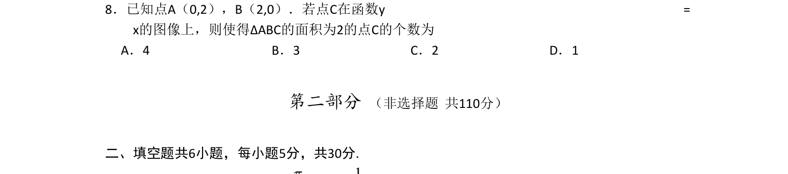

## 题面

## 摘要

已知点A、B，点C在y=x上，求使三角形ABC面积为2的点C个数，考查面积公式与方程求解。

## 关联考点

- [[062-多边形面积|三角形面积]]
- [[1212-点到直线距离|点到直线距离]]
- [[187-函数图象|函数图像]]
- [[绝对值方程]]

## 答案与解析

> 📄 原 PDF 第 2 页：`素材/真题/北京/2008-2024·（北京）数学高考真题/2011年高考数学试卷（文）（北京）（解析卷）.pdf`
