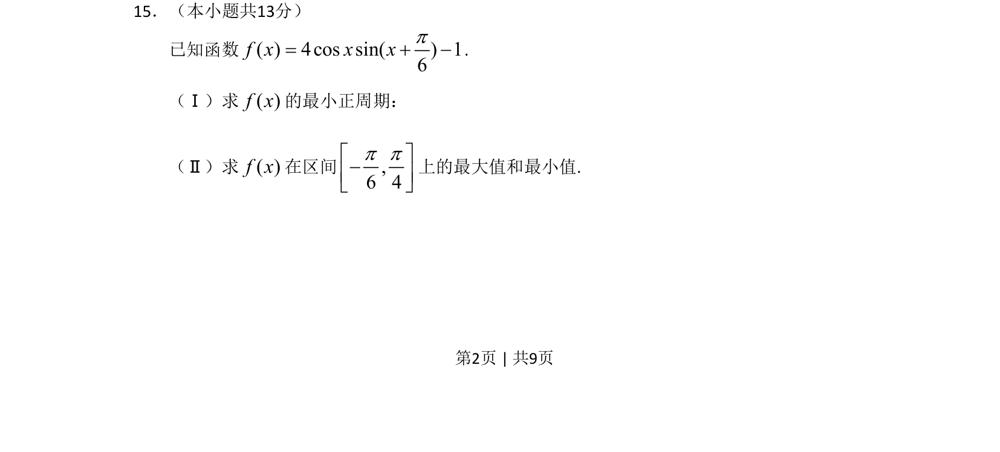

## 题面

## 摘要

考查三角函数恒等变换、最小正周期计算及给定区间上最大值最小值的求解。

## 关联考点

- [[1248-三角函数恒等变换|三角函数恒等变换]]
- [[最小正周期]]
- [[607-三角函数最值|三角函数最值]]

## 答案与解析

> 📄 原 PDF 第 2 页：`素材/真题/北京/2008-2024·（北京）数学高考真题/2011年高考数学试卷（文）（北京）（解析卷）.pdf`
