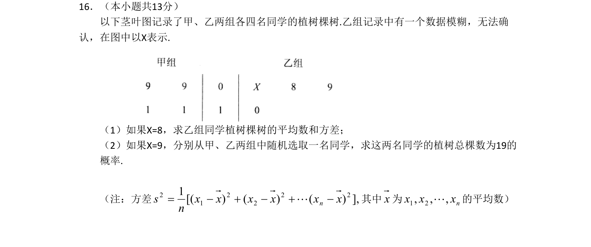

## 题面

## 摘要

甲、乙两组植树棵树的茎叶图，根据模糊数据计算平均数和方差，以及求两名同学植树总棵数为19的概率。

## 关联考点

- [[360-茎叶图|茎叶图]]
- [[055-平均数|平均数]]
- [[198-方差|方差]]
- [[320-古典概型|古典概型]]

## 答案与解析

> 📄 原 PDF 第 3 页：`素材/真题/北京/2008-2024·（北京）数学高考真题/2011年高考数学试卷（文）（北京）（解析卷）.pdf`
