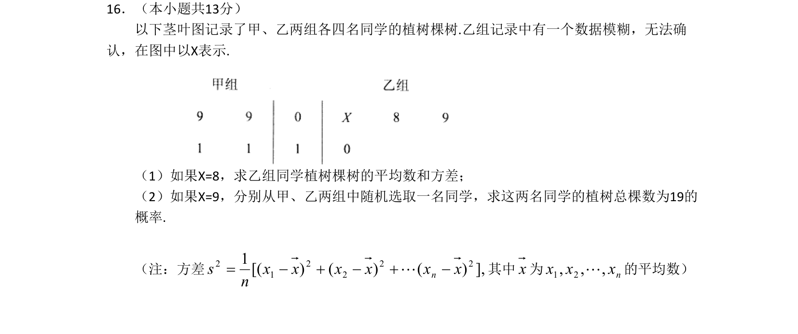

## 题面

## 摘要

甲、乙两组植树棵树的茎叶图，根据模糊数据计算平均数和方差，以及求两名同学植树总棵数为19的概率。

## 关联考点

- [[360-茎叶图|茎叶图]]
- [[055-平均数|平均数]]
- [[198-方差|方差]]
- [[320-古典概型|古典概型]]

## 答案与解析

> 📄 原 PDF 第 3 页：`素材/真题/北京/2008-2024·（北京）数学高考真题/2011年高考数学试卷（文）（北京）（解析卷）.pdf`

<!-- 题干文本-start -->
## 题干文本
16．（本小题共13分）
以下茎叶图记录了甲、乙两组各四名同学的植树棵树.乙组记录中有一个数据模糊，无法确
认，在图中以X表示.
（1）如果X=8，求乙组同学植树棵树的平均数和方差；
（2）如果X=9，分别从甲、乙两组中随机选取一名同学，求这两名同学的植树总棵数为19的
概率.
    
（注：方差 ],)()()[(1222212 xxxxxxnsn-+-+-=Λ其中x为 nxxx,,,21Λ的平均数）
<!-- 题干文本-end -->

<!-- 解析文本-start -->
## 解析文本

<!-- 解析文本-end -->
