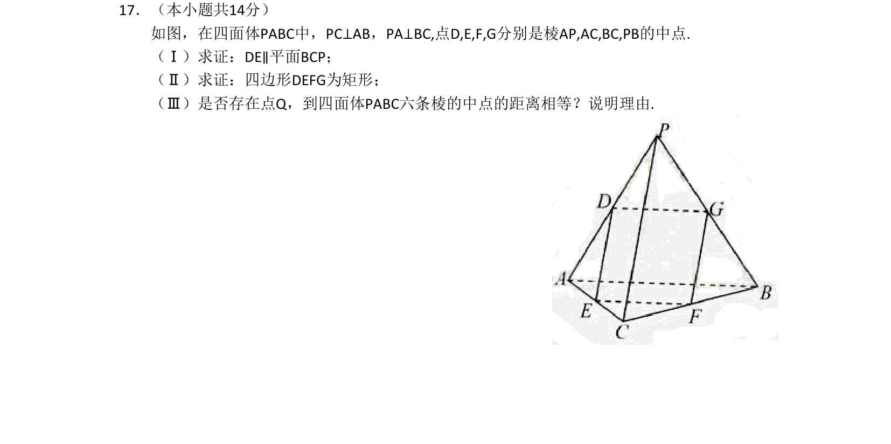

## 题面

## 摘要

线面平行判定、中点四边形性质、矩形判定、四面体六棱中点等距存在性探究

## 关联考点

- [[1089-线面平行判定|线面平行判定]]
- [[中点四边形]]
- [[矩形判定与性质]]
- [[空间点等距问题]]

## 答案与解析

> 📄 原 PDF 第 3 页：`素材/真题/北京/2008-2024·（北京）数学高考真题/2011年高考数学试卷（文）（北京）（解析卷）.pdf`
