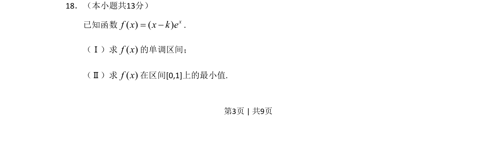

## 题面

## 摘要

已知含参函数，求单调区间与闭区间最小值，需分类讨论。

## 关联考点

- [[549-导数运算|导数运算]]
- [[705-利用导数研究函数的单调性|利用导数研究函数的单调性]]
- [[286-函数的最值|函数的最值]]

## 答案与解析

> 📄 原 PDF 第 3 页：`素材/真题/北京/2008-2024·（北京）数学高考真题/2011年高考数学试卷（文）（北京）（解析卷）.pdf`
