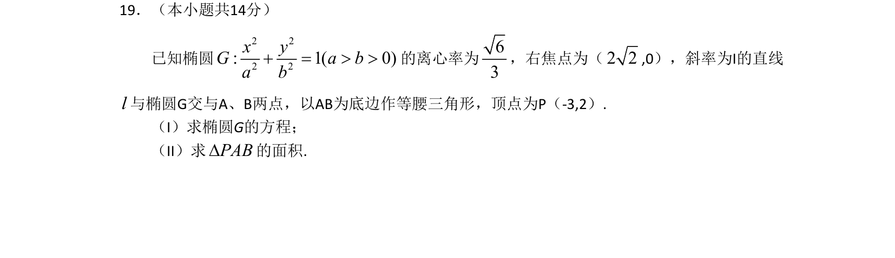

## 题面

## 摘要

求椭圆方程并计算直线与椭圆相交构成的三角形面积。

## 关联考点

- [[389-椭圆定义与方程|椭圆]]
- [[391-椭圆离心率|离心率]]
- [[574-直线与圆锥曲线|直线与圆锥曲线]]
- [[062-多边形面积|三角形面积]]

## 答案与解析

> 📄 原 PDF 第 4 页：`素材/真题/北京/2008-2024·（北京）数学高考真题/2011年高考数学试卷（文）（北京）（解析卷）.pdf`
