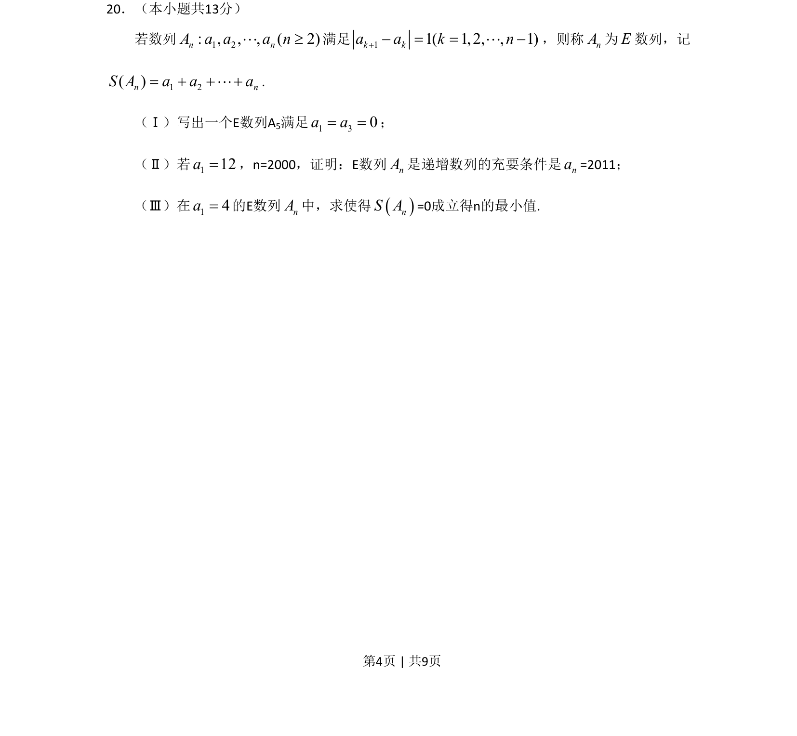
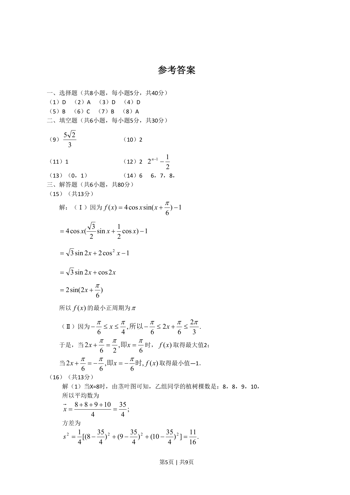
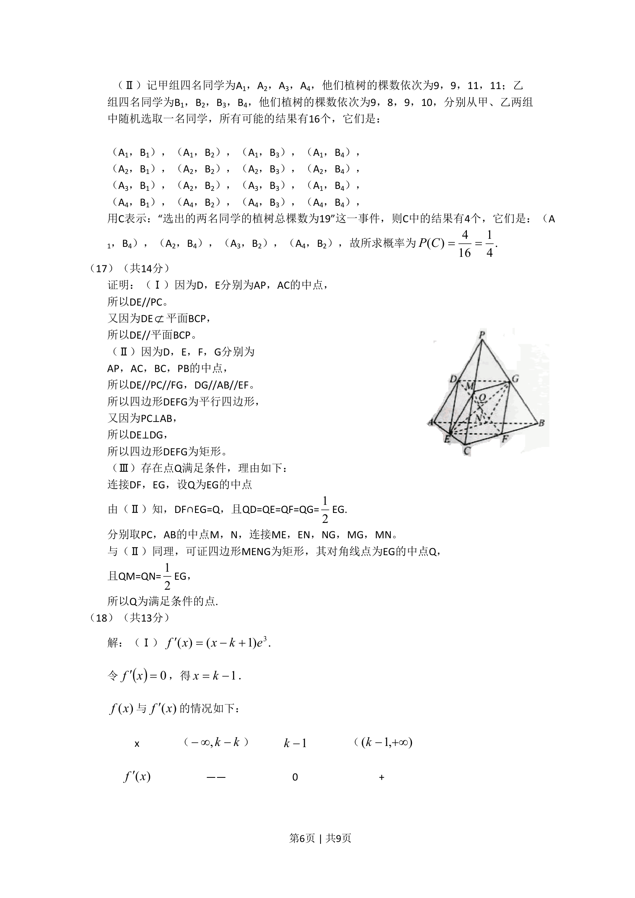
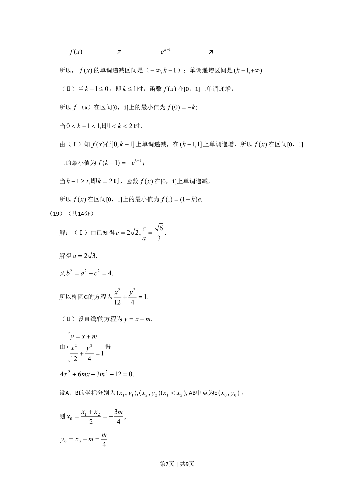
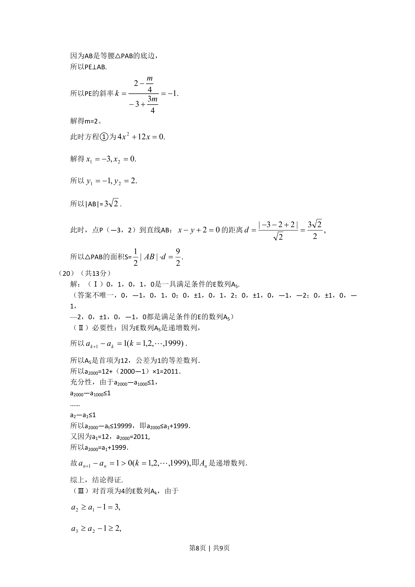
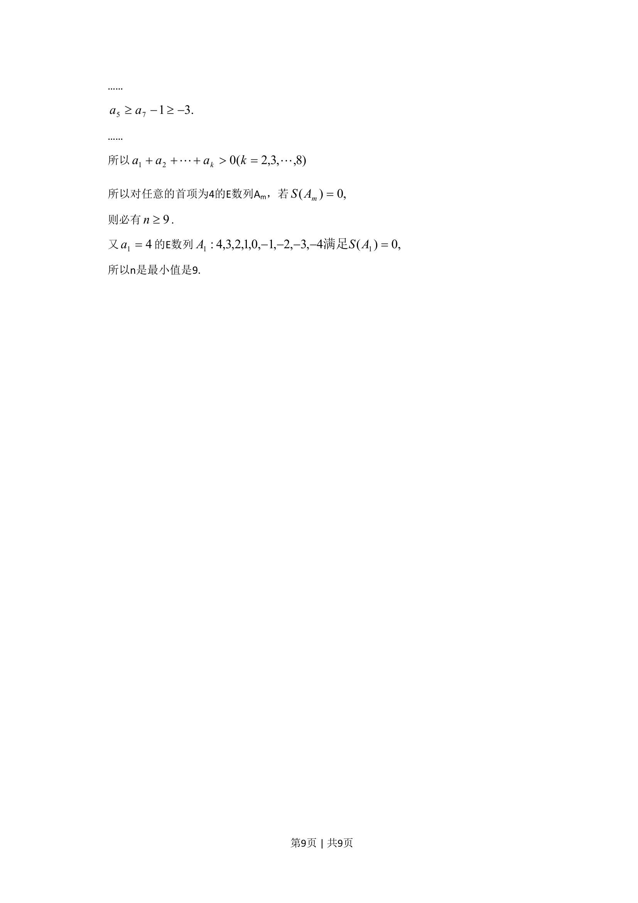

## 题面

## 摘要

本题以新定义E数列为背景，考查数列通项、递推关系、数学归纳法证明充要条件及数列求和最值问题。

## 关联考点

- [[数列新定义]]
- [[386-数学归纳法-初步|数学归纳法]]
- [[279-充要条件|充要条件]]
- [[914-最值问题|最值问题]]

## 答案与解析

> 📄 原 PDF 第 4 页：`素材/真题/北京/2008-2024·（北京）数学高考真题/2011年高考数学试卷（文）（北京）（解析卷）.pdf`
