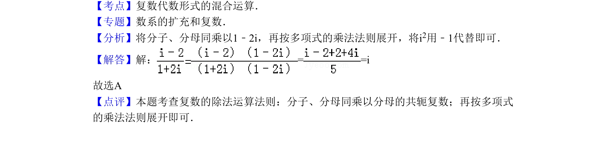

## 题面

## 摘要

复数的除法运算，通过分子分母同乘分母的共轭复数化简求值。

## 关联考点

- [[复数代数形式的混合运算]]
- [[复数的除法]]

## 答案与解析

> 📄 原 PDF 第 1 页：`素材/真题/北京/2008-2024·（北京）数学高考真题/2011年高考数学试卷（理）（北京）（解析卷）.pdf`

<!-- 题干文本-start -->
## 题干文本
2．（5分）（2011•北京）复数=（　　）
A．i B．﹣i C．D．
<!-- 题干文本-end -->

<!-- 解析文本-start -->
## 解析文本
【考点】复数代数形式的混合运算．菁优网版权所有
【专题】数系的扩充和复数．
【分析】将分子、分母同乘以1﹣2i，再按多项式的乘法法则展开，将i2用﹣1代替即可．
【解答】解：= =i
故选A
【点评】本题考查复数的除法运算法则：分子、分母同乘以分母的共轭复数；再按多项式
的乘法法则展开即可．
<!-- 解析文本-end -->
