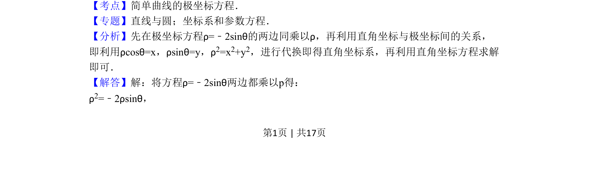
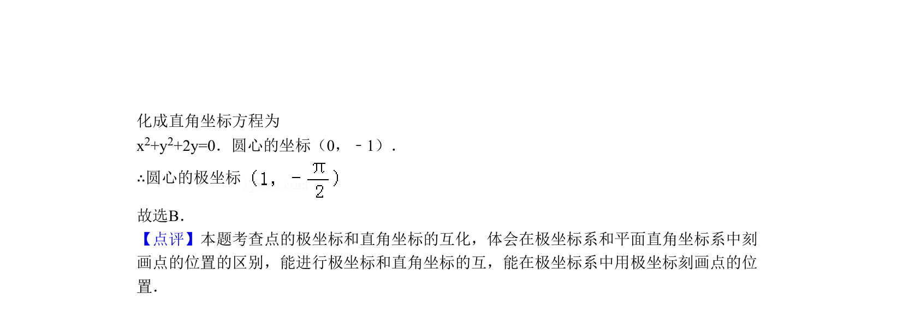

## 题面

## 摘要

极坐标方程转化为直角坐标方程并求圆心坐标

## 关联考点

- [[922-极坐标方程|极坐标方程]]
- [[1032-直角坐标与极坐标互化|直角坐标与极坐标互化]]
- [[782-圆的方程|圆的方程]]

## 答案与解析

> 📄 原 PDF 第 1 页：`素材/真题/北京/2008-2024·（北京）数学高考真题/2011年高考数学试卷（理）（北京）（解析卷）.pdf`
