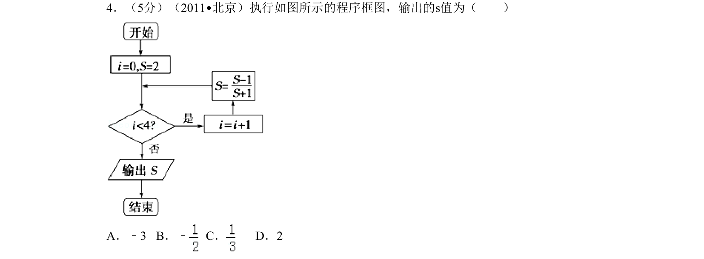
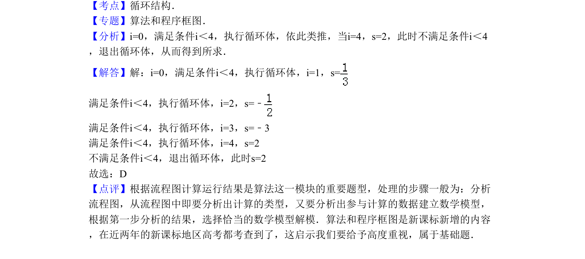

## 题面

## 摘要

程序框图循环结构，根据条件逐步执行并输出最终结果。

## 关联考点

- [[1075-算法|算法]]
- [[1042-程序框图|程序框图]]
- [[870-循环结构|循环结构]]

## 答案与解析

> 📄 原 PDF 第 2 页：`素材/真题/北京/2008-2024·（北京）数学高考真题/2011年高考数学试卷（理）（北京）（解析卷）.pdf`

<!-- 题干文本-start -->
## 题干文本
4．（5分）（2011•北京）执行如图所示的程序框图，输出的s值为（　　）
A．﹣3 B．﹣C．D．2
<!-- 题干文本-end -->

<!-- 解析文本-start -->
## 解析文本
【考点】循环结构．菁优网版权所有
【专题】算法和程序框图．
【分析】i=0，满足条件i＜4，执行循环体，依此类推，当i=4，s=2，此时不满足条件i＜4
，退出循环体，从而得到所求．
【解答】解：i=0，满足条件i＜4，执行循环体，i=1，s=
满足条件i＜4，执行循环体，i=2，s=﹣
满足条件i＜4，执行循环体，i=3，s=﹣3
满足条件i＜4，执行循环体，i=4，s=2
不满足条件i＜4，退出循环体，此时s=2
故选：D
【点评】根据流程图计算运行结果是算法这一模块的重要题型，处理的步骤一般为：分析
流程图，从流程图中即要分析出计算的类型，又要分析出参与计算的数据建立数学模型，
根据第一步分析的结果，选择恰当的数学模型解模．算法和程序框图是新课标新增的内容
，在近两年的新课标地区高考都考查到了，这启示我们要给予高度重视，属于基础题．
<!-- 解析文本-end -->
