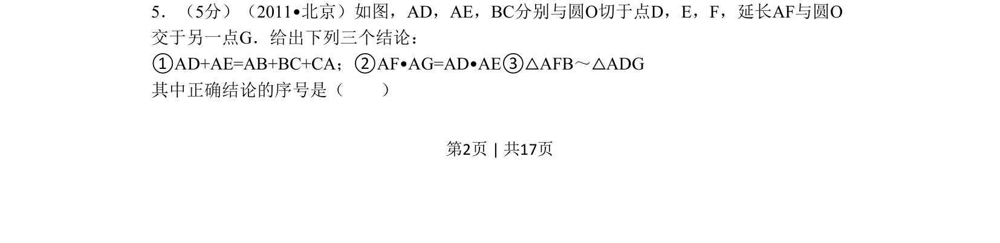
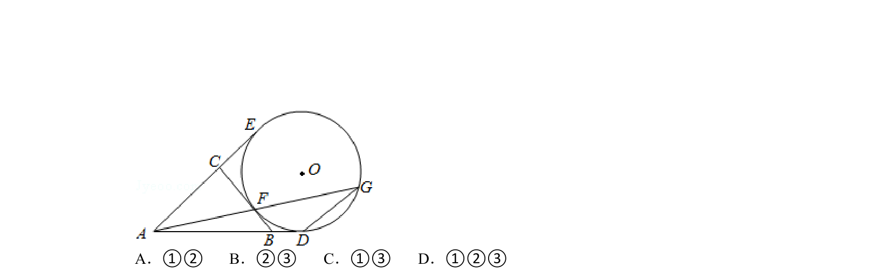
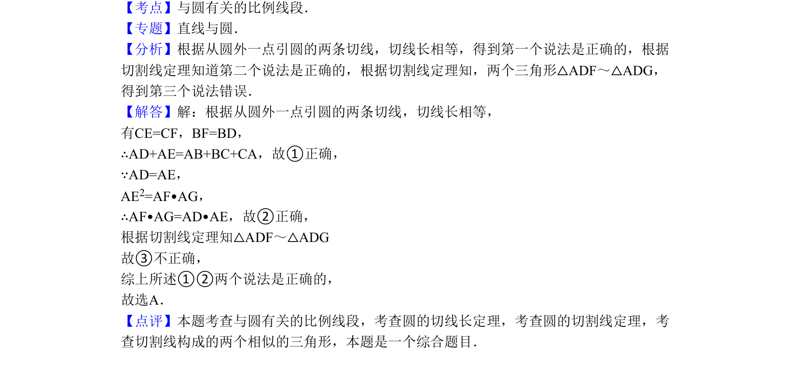

## 题面

## 摘要

几何证明中圆的切线性质、切割线定理及三角形相似判定的综合应用。

## 关联考点

- [[702-切线性质|切线性质]]
- [[700-切割线定理|切割线定理]]
- [[1034-相似三角形判定|相似三角形判定]]

## 答案与解析

> 📄 原 PDF 第 2 页：`素材/真题/北京/2008-2024·（北京）数学高考真题/2011年高考数学试卷（理）（北京）（解析卷）.pdf`
