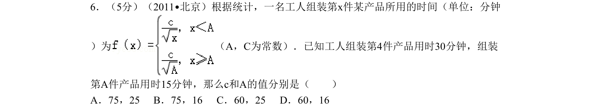
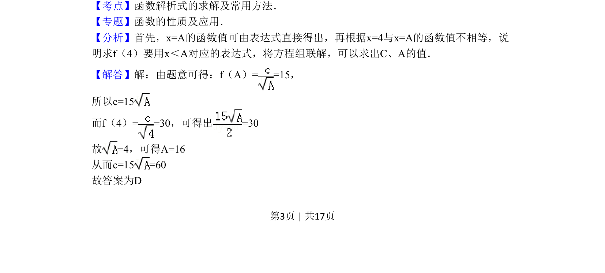

## 题面

## 摘要

本题通过分段函数模型，根据给定函数值列方程组求解参数。

## 关联考点

- [[函数解析式求解]]
- [[290-分段函数|分段函数]]
- [[906-方程思想|方程思想]]

## 答案与解析

> 📄 原 PDF 第 3 页：`素材/真题/北京/2008-2024·（北京）数学高考真题/2011年高考数学试卷（理）（北京）（解析卷）.pdf`

<!-- 题干文本-start -->
## 题干文本
6．（5分）（2011•北京）根据统计，一名工人组装第x件某产品所用的时间（单位：分钟
）为 （A，C为常数）．已知工人组装第4件产品用时30分钟，组装
第A件产品用时15分钟，那么c和A的值分别是（　　）
A．75，25 B．75，16 C．60，25 D．60，16
<!-- 题干文本-end -->

<!-- 解析文本-start -->
## 解析文本
【考点】函数解析式的求解及常用方法．菁优网版权所有
【专题】函数的性质及应用．
【分析】首先，x=A的函数值可由表达式直接得出，再根据x=4与x=A的函数值不相等，说
明求f（4）要用x＜A对应的表达式，将方程组联解，可以求出C、A的值．
【解答】解：由题意可得：f（A）= =15，
所以c=15
而f（4）= =30，可得出=30
故=4，可得A=16
从而c=15 =60
故答案为D
<!-- 解析文本-end -->
