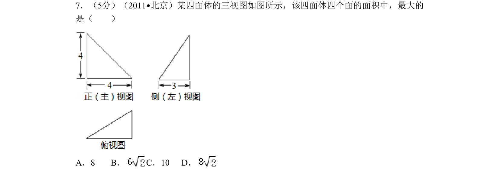
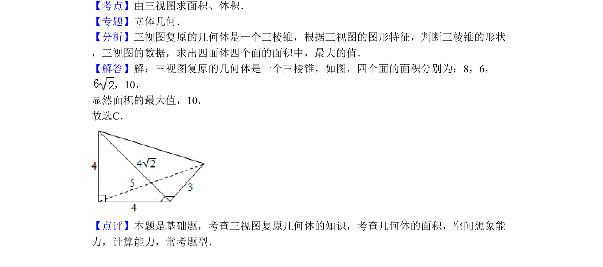

## 题面

## 摘要

三视图还原几何体，计算四面体各面面积并比较最大值。

## 关联考点

- [[1198-由三视图求面积|由三视图求面积]]
- [[349-空间几何体表面积|空间几何体表面积]]
- [[599-三棱锥|三棱锥]]

## 答案与解析

> 📄 原 PDF 第 4 页：`素材/真题/北京/2008-2024·（北京）数学高考真题/2011年高考数学试卷（理）（北京）（解析卷）.pdf`
