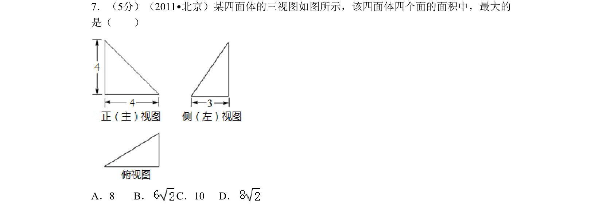
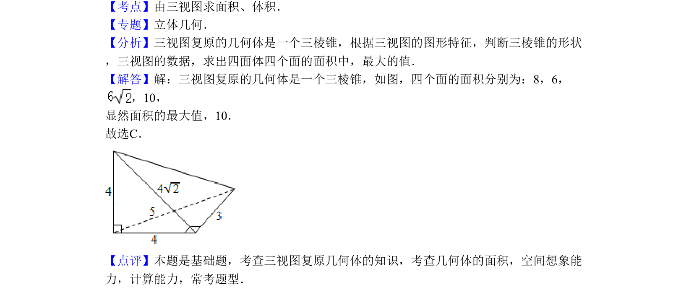

## 题面

## 摘要

三视图还原几何体，计算四面体各面面积并比较最大值。

## 关联考点

- [[1198-由三视图求面积|由三视图求面积]]
- [[349-空间几何体表面积|空间几何体表面积]]
- [[599-三棱锥|三棱锥]]

## 答案与解析

> 📄 原 PDF 第 4 页：`素材/真题/北京/2008-2024·（北京）数学高考真题/2011年高考数学试卷（理）（北京）（解析卷）.pdf`

<!-- 题干文本-start -->
## 题干文本
7．（5分）（2011•北京）某四面体的三视图如图所示，该四面体四个面的面积中，最大的
是（　　）
A．8 B．C．10 D．
<!-- 题干文本-end -->

<!-- 解析文本-start -->
## 解析文本
【考点】由三视图求面积、体积．菁优网版权所有
【专题】立体几何．
【分析】三视图复原的几何体是一个三棱锥，根据三视图的图形特征，判断三棱锥的形状
，三视图的数据，求出四面体四个面的面积中，最大的值．
【解答】解：三视图复原的几何体是一个三棱锥，如图，四个面的面积分别为：8，6，
，10，
显然面积的最大值，10．
故选C．
【点评】本题是基础题，考查三视图复原几何体的知识，考查几何体的面积，空间想象能
力，计算能力，常考题型．
<!-- 解析文本-end -->
