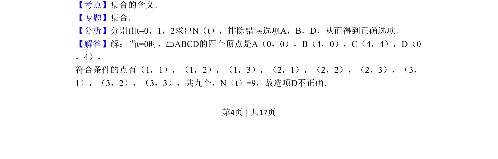
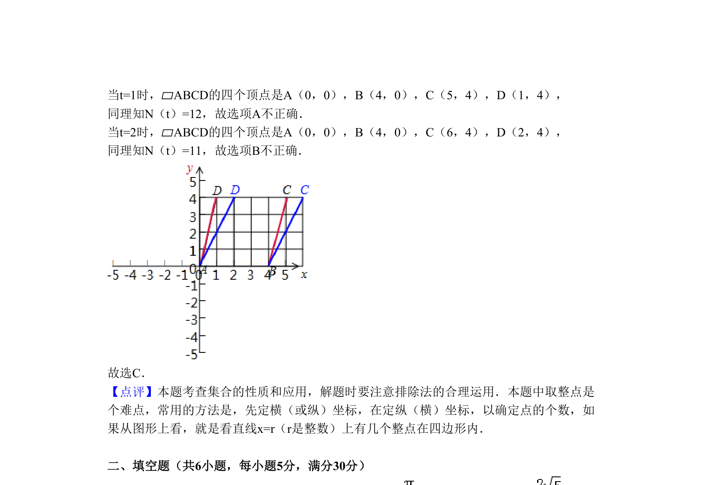

## 题面

## 摘要

考查平行四边形内部整点个数的函数值域，利用特值法求解。

## 关联考点

- [[集合的含义]]
- [[676-函数值域|函数的值域]]
- [[1384-整点|整点]]

## 答案与解析

> 📄 原 PDF 第 4 页：`素材/真题/北京/2008-2024·（北京）数学高考真题/2011年高考数学试卷（理）（北京）（解析卷）.pdf`

<!-- 题干文本-start -->
## 题干文本
8．（5分）（2011•北京）设A（0，0），B（4，0），C（t+4，4），D（t，4）（t∈R）．
记N（t）为平行四边形ABCD内部（不含边界）的整点的个数，其中整点是指横、纵坐标
都是整数的点，则函数N（t）的值域为（　　）
A．{9，10，11} B．{9，10，12} C．{9，11，12} D．{10，11，12}
<!-- 题干文本-end -->

<!-- 解析文本-start -->
## 解析文本
【考点】集合的含义．菁优网版权所有
【专题】集合．
【分析】分别由t=0，1，2求出N（t），排除错误选项A，B，D，从而得到正确选项．
【解答】解：当t=0时，▱ABCD的四个顶点是A（0，0），B（4，0），C（4，4），D（0
，4），
符合条件的点有（1，1），（1，2），（1，3），（2，1），（2，2），（2，3），（3，
1），（3，2），（3，3），共九个，N（t）=9，故选项D不正确．
<!-- 解析文本-end -->
