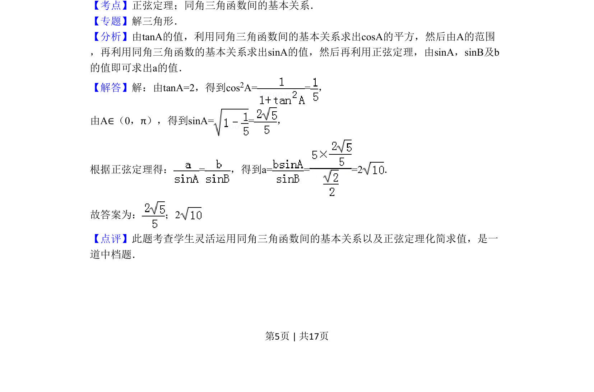

## 题面

## 摘要

在三角形中，已知一边、一角正切求正弦值，并利用正弦定理求另一边的值。

## 关联考点

- [[126-定理|正弦定理]]
- [[741-同角三角函数基本关系|同角三角函数基本关系]]

## 答案与解析

> 📄 原 PDF 第 5 页：`素材/真题/北京/2008-2024·（北京）数学高考真题/2011年高考数学试卷（理）（北京）（解析卷）.pdf`

<!-- 题干文本-start -->
## 题干文本
9．（5分）（2011•北京）在△ABC中．若b=5， ，tanA=2，则sinA=　 　；a=　
2 　．
<!-- 题干文本-end -->

<!-- 解析文本-start -->
## 解析文本
【考点】正弦定理；同角三角函数间的基本关系．菁优网版权所有
【专题】解三角形．
【分析】由tanA的值，利用同角三角函数间的基本关系求出cosA的平方，然后由A的范围
，再利用同角三角函数的基本关系求出sinA的值，然后再利用正弦定理，由sinA，sinB及b
的值即可求出a的值．
【解答】解：由tanA=2，得到cos2A= =，
由A∈（0，π），得到sinA= =，
根据正弦定理得：=，得到a= = =2．
故答案为： ；2
【点评】此题考查学生灵活运用同角三角函数间的基本关系以及正弦定理化简求值，是一
道中档题．
<!-- 解析文本-end -->
