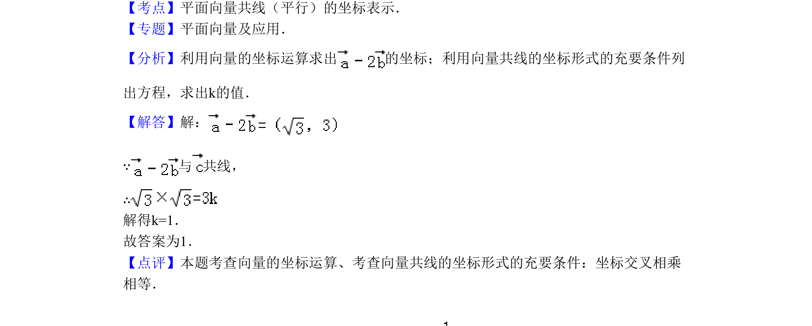

## 题面

## 摘要

该题考查平面向量坐标运算及利用共线坐标形式求参数。

## 关联考点

- [[平面向量共线（平行）的坐标表示]]

## 答案与解析

> 📄 原 PDF 第 6 页：`素材/真题/北京/2008-2024·（北京）数学高考真题/2011年高考数学试卷（理）（北京）（解析卷）.pdf`

<!-- 题干文本-start -->
## 题干文本
10．（5分）（2011•北京）已知向量=（ ，1），=（0，﹣1），=（k， ）．若
与 共线，则k=　1　．
<!-- 题干文本-end -->

<!-- 解析文本-start -->
## 解析文本
【考点】平面向量共线（平行）的坐标表示．菁优网版权所有
【专题】平面向量及应用．
【分析】利用向量的坐标运算求出 的坐标；利用向量共线的坐标形式的充要条件列
出方程，求出k的值．
【解答】解：
∵与 共线，
∴
解得k=1．
故答案为1．
【点评】本题考查向量的坐标运算、考查向量共线的坐标形式的充要条件：坐标交叉相乘
相等．
<!-- 解析文本-end -->
