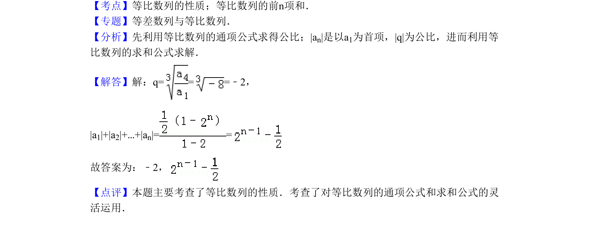

## 题面

## 摘要

在等比数列中，已知两项求公比，并计算各项绝对值的和。

## 关联考点

- [[1070-等比数列通项公式|等比数列通项公式]]
- [[等比数列前n项和公式]]

## 答案与解析

> 📄 原 PDF 第 6 页：`素材/真题/北京/2008-2024·（北京）数学高考真题/2011年高考数学试卷（理）（北京）（解析卷）.pdf`

<!-- 题干文本-start -->
## 题干文本
11．（5分）（2011•北京）在等比数列{an}中，a1=，a 4=﹣4，则公比q=　﹣2　
；|a1|+|a2|+…+|an|=　 　．
<!-- 题干文本-end -->

<!-- 解析文本-start -->
## 解析文本
【考点】等比数列的性质；等比数列的前n项和．菁优网版权所有
【专题】等差数列与等比数列．
【分析】先利用等比数列的通项公式求得公比；|an|是以a1为首项，|q|为公比，进而利用等
比数列的求和公式求解．
【解答】解：q= = =﹣2，
|a1|+|a2|+…+|an|= =
故答案为：﹣2，
【点评】本题主要考查了等比数列的性质．考查了对等比数列的通项公式和求和公式的灵
活运用．
<!-- 解析文本-end -->
