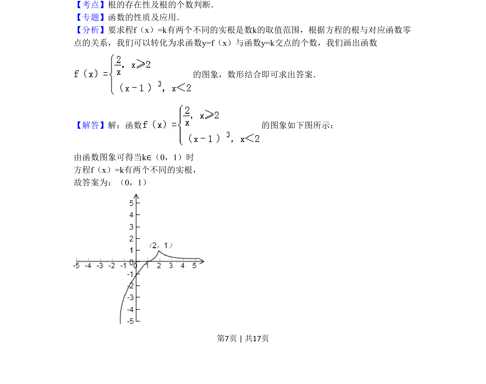

## 题面

## 摘要

本题通过分段函数图象与水平直线交点个数，求参数取值范围，考查方程根的转化与数形结合思想。

## 关联考点

- [[根的存在性及根的个数判断]]
- [[290-分段函数|分段函数]]
- [[898-数形结合|数形结合]]

## 答案与解析

> 📄 原 PDF 第 7 页：`素材/真题/北京/2008-2024·（北京）数学高考真题/2011年高考数学试卷（理）（北京）（解析卷）.pdf`
