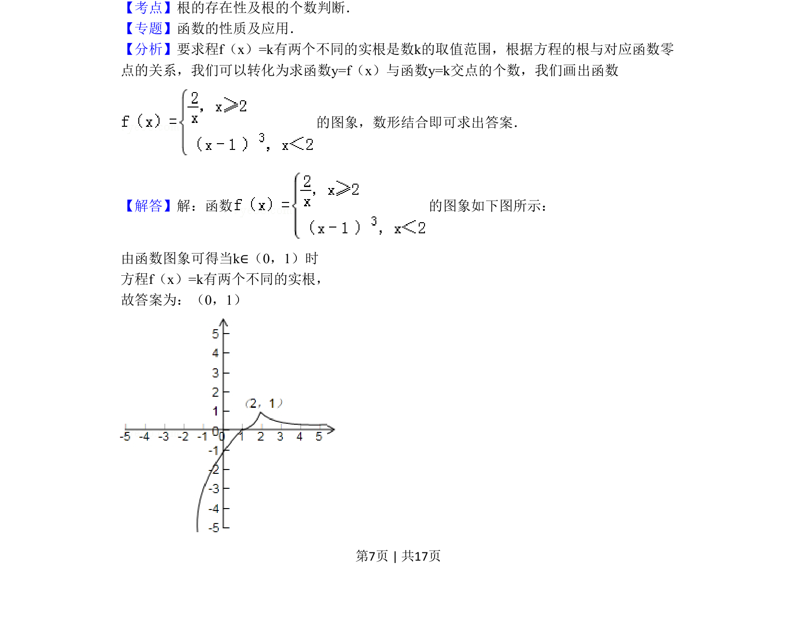

## 题面

## 摘要

本题通过分段函数图象与水平直线交点个数，求参数取值范围，考查方程根的转化与数形结合思想。

## 关联考点

- [[根的存在性及根的个数判断]]
- [[290-分段函数|分段函数]]
- [[897-数形结合|数形结合]]

## 答案与解析

> 📄 原 PDF 第 7 页：`素材/真题/北京/2008-2024·（北京）数学高考真题/2011年高考数学试卷（理）（北京）（解析卷）.pdf`

<!-- 题干文本-start -->
## 题干文本
13．（5分）（2011•北京）已知函数 若关于x 
的方程f（x）=k有两个不同的实根，则数k的取值范围是　（0，1）　．
<!-- 题干文本-end -->

<!-- 解析文本-start -->
## 解析文本
【考点】根的存在性及根的个数判断．菁优网版权所有
【专题】函数的性质及应用．
【分析】要求程f（x）=k有两个不同的实根是数k的取值范围，根据方程的根与对应函数零
点的关系，我们可以转化为求函数y=f（x）与函数y=k交点的个数，我们画出函数
的图象，数形结合即可求出答案．
【解答】解：函数 的图象如下图所示：
由函数图象可得当k∈（0，1）时
方程f（x）=k有两个不同的实根，
故答案为：（0，1）
<!-- 解析文本-end -->
