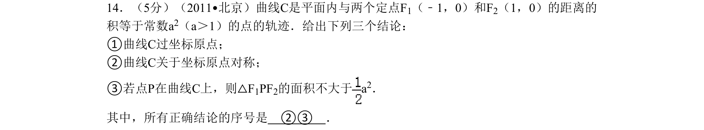
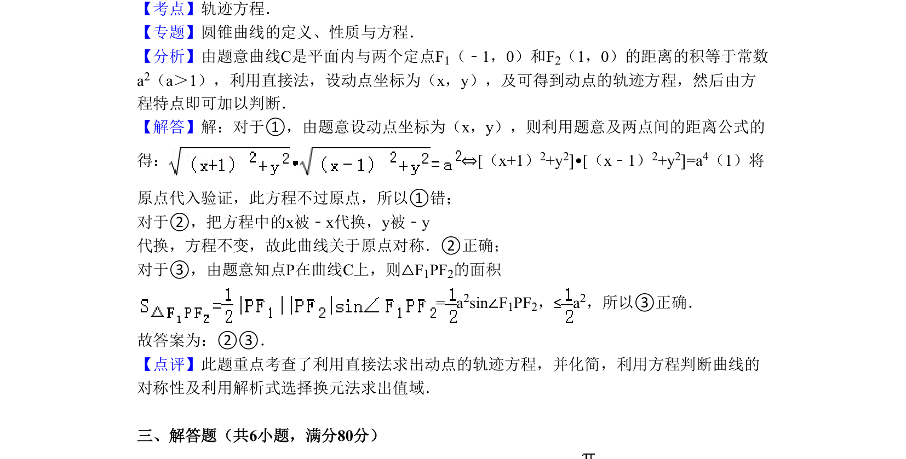

## 题面

## 摘要

曲线C是到两定点距离之积为常数的轨迹，判断其过原点、对称性和焦点三角形面积结论。

## 关联考点

- [[376-圆锥曲线轨迹问题|轨迹方程]]
- [[曲线对称性]]
- [[062-多边形面积|三角形面积]]
- [[直接法]]

## 答案与解析

> 📄 原 PDF 第 8 页：`素材/真题/北京/2008-2024·（北京）数学高考真题/2011年高考数学试卷（理）（北京）（解析卷）.pdf`
