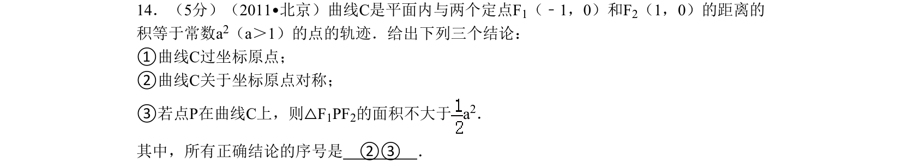
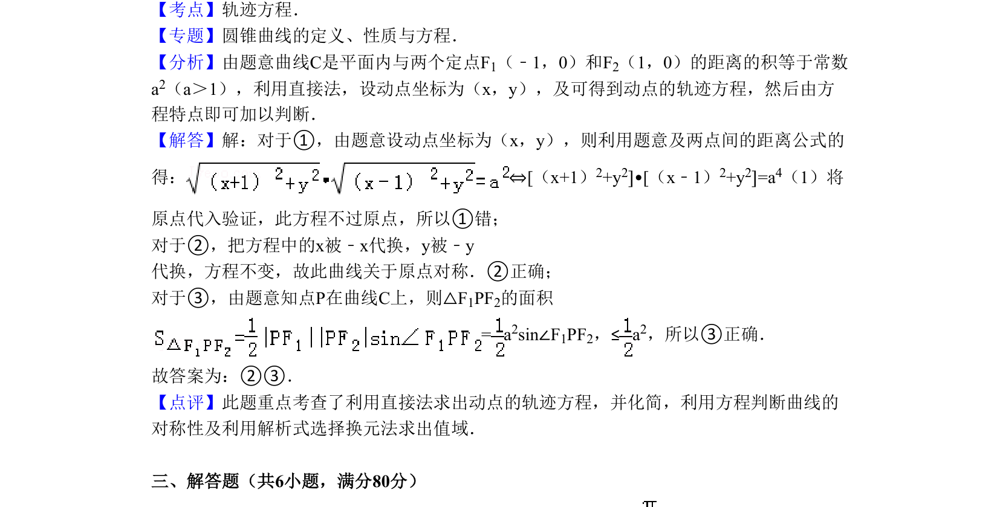

## 题面

## 摘要

曲线C是到两定点距离之积为常数的轨迹，判断其过原点、对称性和焦点三角形面积结论。

## 关联考点

- [[376-圆锥曲线轨迹问题|轨迹方程]]
- [[曲线对称性]]
- [[062-多边形面积|三角形面积]]
- [[直接法]]

## 答案与解析

> 📄 原 PDF 第 8 页：`素材/真题/北京/2008-2024·（北京）数学高考真题/2011年高考数学试卷（理）（北京）（解析卷）.pdf`

<!-- 题干文本-start -->
## 题干文本
14．（5分）（2011•北京）曲线C是平面内与两个定点F1（﹣1，0）和F2（1，0）的距离的
积等于常数a2（a＞1）的点的轨迹．给出下列三个结论：
①曲线C过坐标原点；
②曲线C关于坐标原点对称；
③若点P在曲线C上，则△F1PF2的面积不大于a 2．
其中，所有正确结论的序号是　②③　．
<!-- 题干文本-end -->

<!-- 解析文本-start -->
## 解析文本
【考点】轨迹方程．菁优网版权所有
【专题】圆锥曲线的定义、性质与方程．
【分析】由题意曲线C是平面内与两个定点F1（﹣1，0）和F2（1，0）的距离的积等于常数
a2（a＞1），利用直接法，设动点坐标为（x，y），及可得到动点的轨迹方程，然后由方
程特点即可加以判断．
【解答】解：对于①，由题意设动点坐标为（x，y），则利用题意及两点间的距离公式的
得：⇔[（x+1） 2+y2]•[（x﹣1）2+y2]=a4（1）将
原点代入验证，此方程不过原点，所以①错；
对于②，把方程中的x被﹣x代换，y被﹣y 
代换，方程不变，故此曲线关于原点对称．②正确；
对于③，由题意知点P在曲线C上，则△F1PF2的面积
= a 2sin∠F1PF2，≤a 2，所以③正确．
故答案为：②③．
【点评】此题重点考查了利用直接法求出动点的轨迹方程，并化简，利用方程判断曲线的
对称性及利用解析式选择换元法求出值域．
　
三、解答题（共6小题，满分80分）
<!-- 解析文本-end -->
