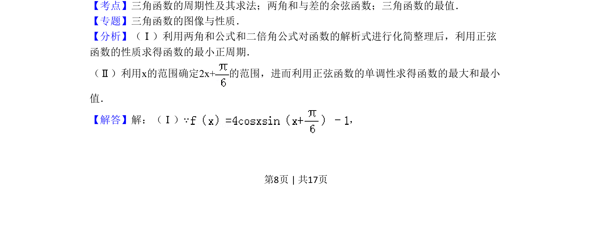
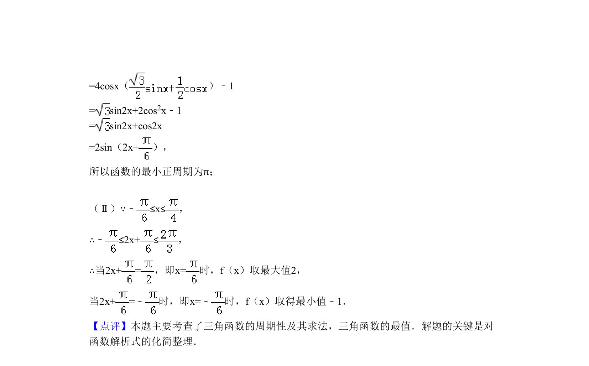

## 题面

## 摘要

考查利用两角和与差公式、二倍角公式化简三角函数式，求最小正周期及闭区间上的最值。

## 关联考点

- [[三角函数的周期性及其求法]]
- [[两角和与差的余弦函数]]
- [[615-三角函数的最值|三角函数的最值]]

## 答案与解析

> 📄 原 PDF 第 8 页：`素材/真题/北京/2008-2024·（北京）数学高考真题/2011年高考数学试卷（理）（北京）（解析卷）.pdf`
