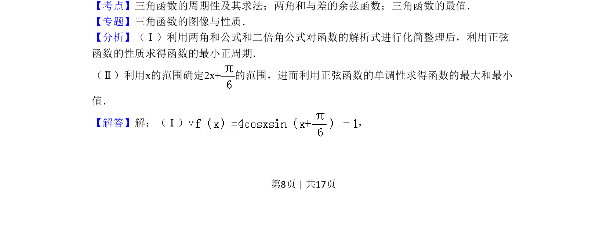
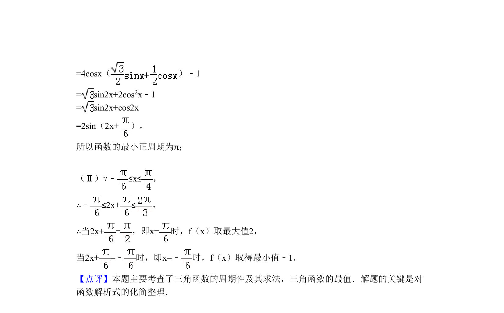

## 题面

## 摘要

考查利用两角和与差公式、二倍角公式化简三角函数式，求最小正周期及闭区间上的最值。

## 关联考点

- [[三角函数的周期性及其求法]]
- [[两角和与差的余弦函数]]
- [[615-三角函数的最值|三角函数的最值]]

## 答案与解析

> 📄 原 PDF 第 8 页：`素材/真题/北京/2008-2024·（北京）数学高考真题/2011年高考数学试卷（理）（北京）（解析卷）.pdf`

<!-- 题干文本-start -->
## 题干文本
15．（13分）（2011•北京）已知函数 ．
（Ⅰ）求f（x）的最小正周期：
（Ⅱ）求f（x）在区间 上的最大值和最小值．
<!-- 题干文本-end -->

<!-- 解析文本-start -->
## 解析文本
【考点】三角函数的周期性及其求法；两角和与差的余弦函数；三角函数的最值．菁优网版权所有
【专题】三角函数的图像与性质．
【分析】（Ⅰ）利用两角和公式和二倍角公式对函数的解析式进行化简整理后，利用正弦
函数的性质求得函数的最小正周期．
（Ⅱ）利用x的范围确定2x+的范围，进而利用正弦函数的单调性求得函数的最大和最小
值．
【解答】解：（Ⅰ）∵，
<!-- 解析文本-end -->
