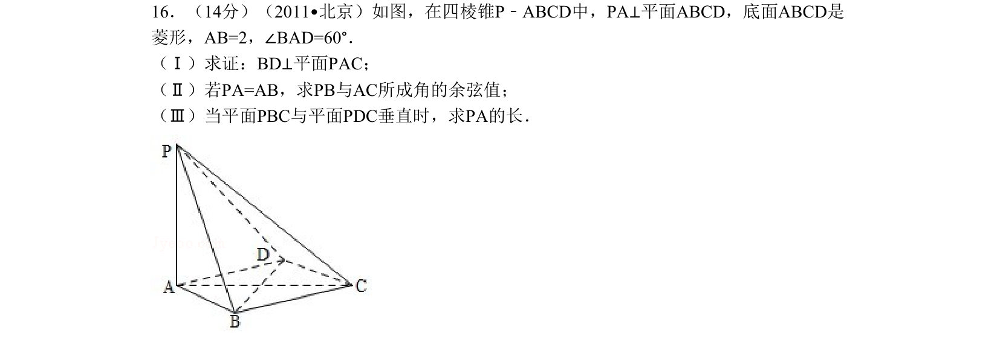
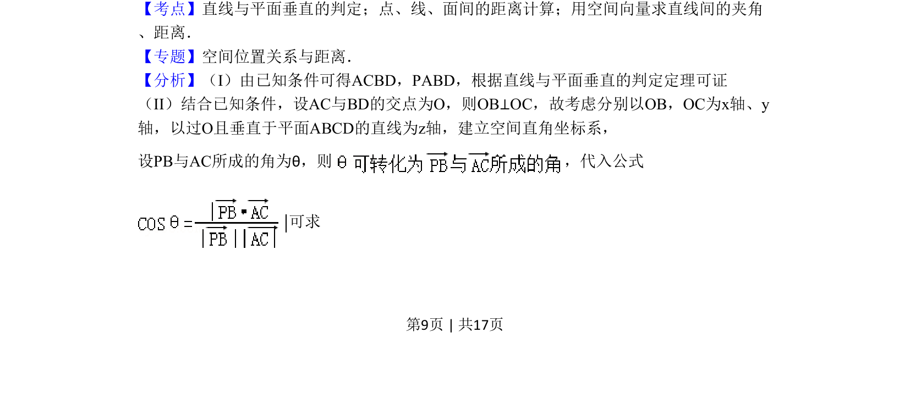
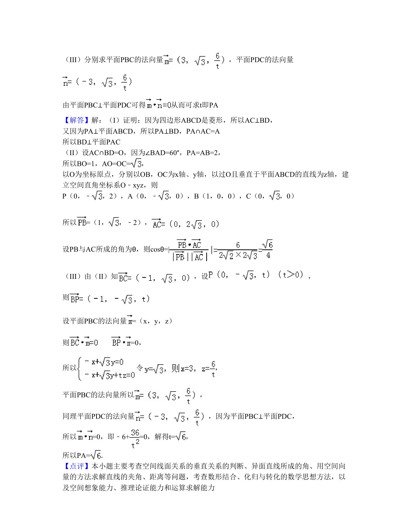

## 题面

## 摘要

在四棱锥中证明线面垂直，用空间向量求异面直线夹角余弦，并利用面面垂直条件求线段长度。

## 关联考点

- [[1088-线面垂直的判定定理|直线与平面垂直的判定]]
- [[用空间向量求直线间的夹角]]
- [[空间距离计算]]
- [[593-面面垂直性质|面面垂直性质]]

## 答案与解析

> 📄 原 PDF 第 9 页：`素材/真题/北京/2008-2024·（北京）数学高考真题/2011年高考数学试卷（理）（北京）（解析卷）.pdf`
