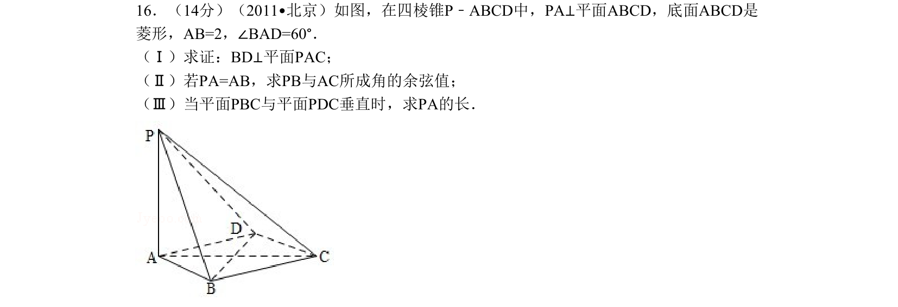
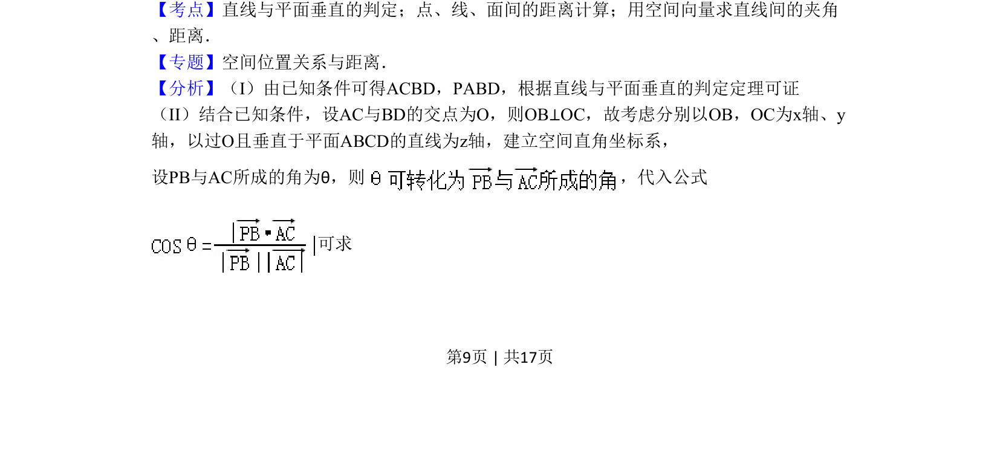
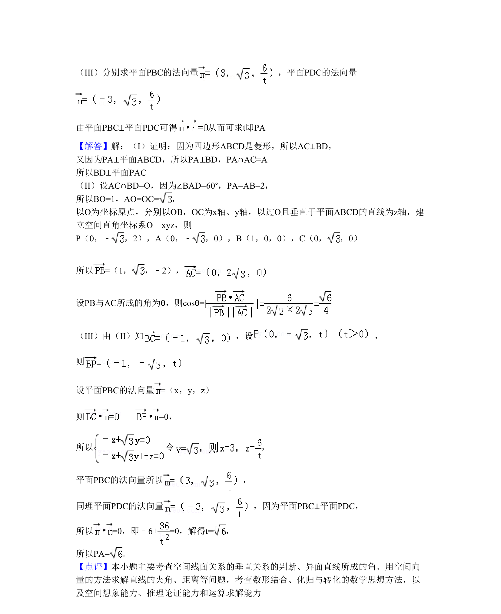

## 题面

## 摘要

在四棱锥中证明线面垂直，用空间向量求异面直线夹角余弦，并利用面面垂直条件求线段长度。

## 关联考点

- [[1087-线面垂直的判定定理|直线与平面垂直的判定]]
- [[用空间向量求直线间的夹角]]
- [[空间距离计算]]
- [[593-面面垂直性质|面面垂直性质]]

## 答案与解析

> 📄 原 PDF 第 9 页：`素材/真题/北京/2008-2024·（北京）数学高考真题/2011年高考数学试卷（理）（北京）（解析卷）.pdf`

<!-- 题干文本-start -->
## 题干文本
16．（14分）（2011•北京）如图，在四棱锥P﹣ABCD中，PA⊥平面ABCD，底面ABCD是
菱形，AB=2，∠BAD=60°．
（Ⅰ）求证：BD⊥平面PAC；
（Ⅱ）若PA=AB，求PB与AC所成角的余弦值；
（Ⅲ）当平面PBC与平面PDC垂直时，求PA的长．
<!-- 题干文本-end -->

<!-- 解析文本-start -->
## 解析文本
【考点】直线与平面垂直的判定；点、线、面间的距离计算；用空间向量求直线间的夹角
、距离．菁优网版权所有
【专题】空间位置关系与距离．
【分析】（I）由已知条件可得ACBD，PABD，根据直线与平面垂直的判定定理可证
（II）结合已知条件，设AC与BD的交点为O，则OB⊥OC，故考虑分别以OB，OC为x轴、y
轴，以过O且垂直于平面ABCD的直线为z轴，建立空间直角坐标系，
设PB与AC所成的角为θ，则 ，代入公式
可求
<!-- 解析文本-end -->
