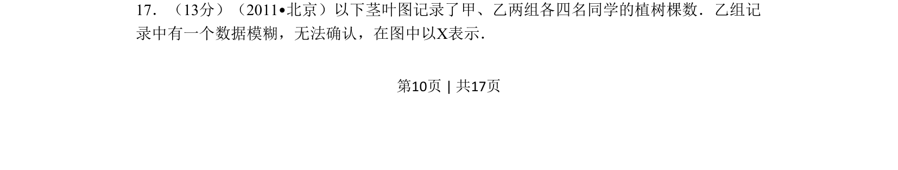
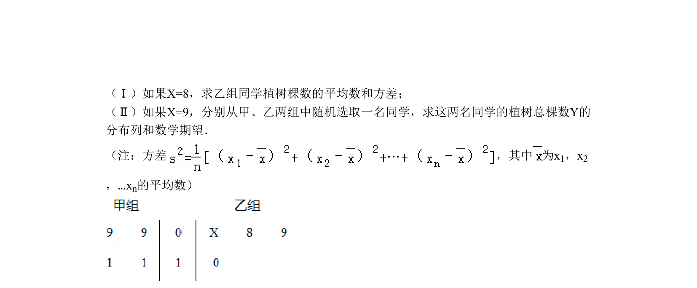
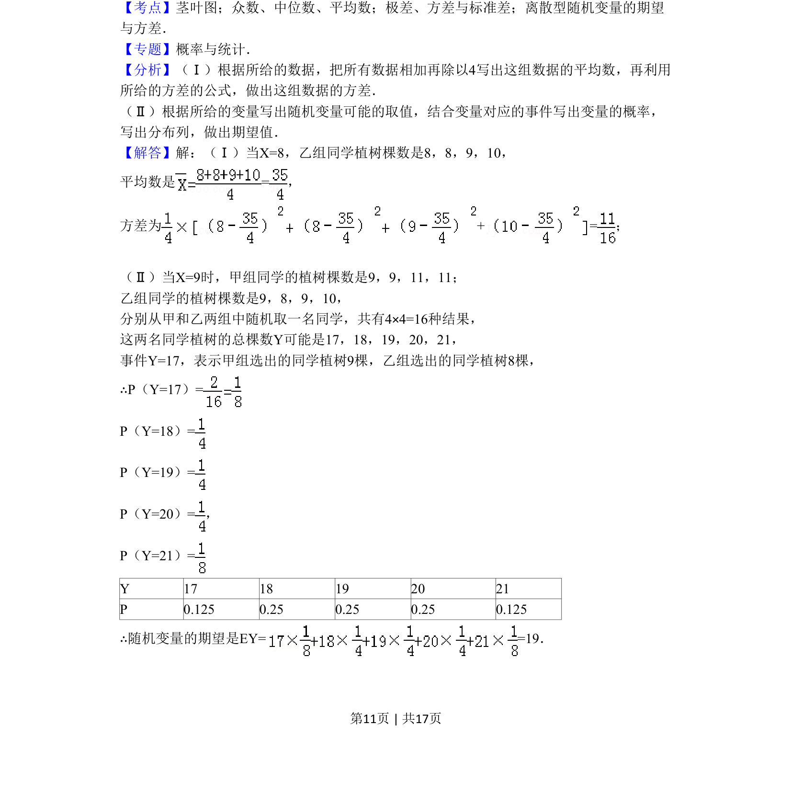
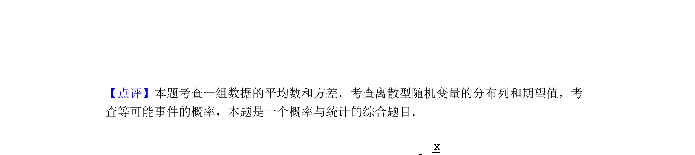

## 题面

## 摘要

茎叶图数据处理及根据统计量确定未知数

## 关联考点

- [[360-茎叶图|茎叶图]]
- [[055-平均数|平均数]]
- [[198-方差|方差]]
- [[508-统计推断|统计推断]]

## 答案与解析

> 📄 原 PDF 第 10 页：`素材/真题/北京/2008-2024·（北京）数学高考真题/2011年高考数学试卷（理）（北京）（解析卷）.pdf`
