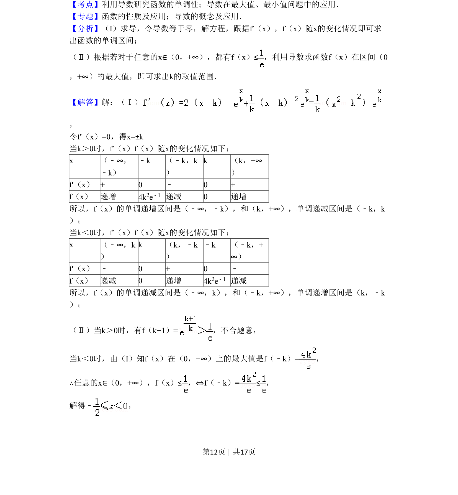
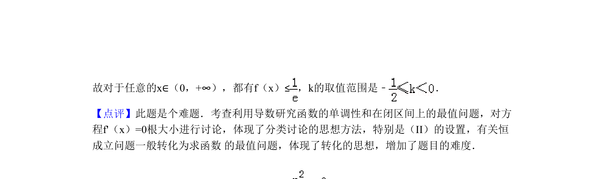

## 题面

## 摘要

利用导数讨论含参函数的单调区间，并解决恒成立问题中参数取值范围。

## 关联考点

- [[705-利用导数研究函数的单调性|利用导数研究函数的单调性]]
- [[导数在最大值]]
- [[最小值问题中的应用]]

## 答案与解析

> 📄 原 PDF 第 12 页：`素材/真题/北京/2008-2024·（北京）数学高考真题/2011年高考数学试卷（理）（北京）（解析卷）.pdf`

<!-- 题干文本-start -->
## 题干文本
18．（13分）（2011•北京）已知函数 ．
（Ⅰ）求f（x）的单调区间；
（Ⅱ）若对于任意的x∈（0，+∞），都有f（x）≤，求k的取值范围．
<!-- 题干文本-end -->

<!-- 解析文本-start -->
## 解析文本
【考点】利用导数研究函数的单调性；导数在最大值、最小值问题中的应用．菁优网版权所有
【专题】函数的性质及应用；导数的概念及应用．
【分析】（I）求导，令导数等于零，解方程，跟据f′（x），f（x）随x的变化情况即可求
出函数的单调区间；
（Ⅱ）根据若对于任意的x∈（0，+∞），都有f（x）≤，利用导数求函数f（x）在区间（0
，+∞）的最大值，即可求出k的取值范围．
【解答】解：（Ⅰ）=
，
令f′（x）=0，得x=±k
当k＞0时，f′（x）f（x）随x的变化情况如下：
x （﹣∞，
﹣k）
﹣k （﹣k，k
）
k （k，+∞
）
f′（x） + 0 ﹣ 0 +
f（x） 递增 4k2e﹣1 递减 0 递增
所以，f（x）的单调递增区间是（﹣∞，﹣k），和（k，+∞），单调递减区间是（﹣k，k
）；
当k＜0时，f′（x）f（x）随x的变化情况如下：
x （﹣∞，k
）
k （k，﹣k
）
﹣k （﹣k，+
∞）
f′（x） ﹣ 0 + 0 ﹣
f（x） 递减 0 递增 4k2e﹣1 递减
所以，f（x）的单调递减区间是（﹣∞，k），和（﹣k，+∞），单调递增区间是（k，﹣k
）；
（Ⅱ）当k＞0时，有f（k+1）=，不合题意，
当k＜0时，由（I）知f（x）在（0，+∞）上的最大值是f（﹣k）=，
∴任意的x∈（0，+∞），f（x）≤，⇔f（﹣k）=≤，
解得﹣，
<!-- 解析文本-end -->
