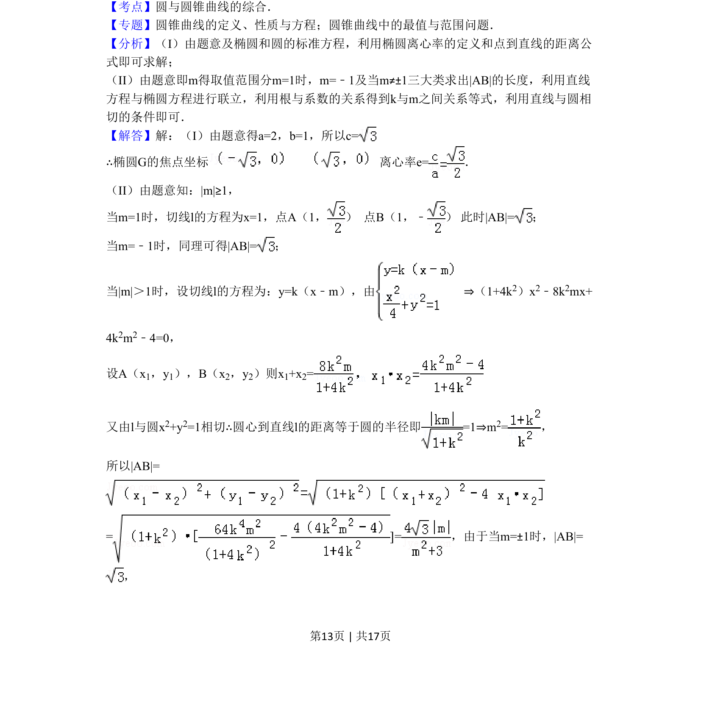
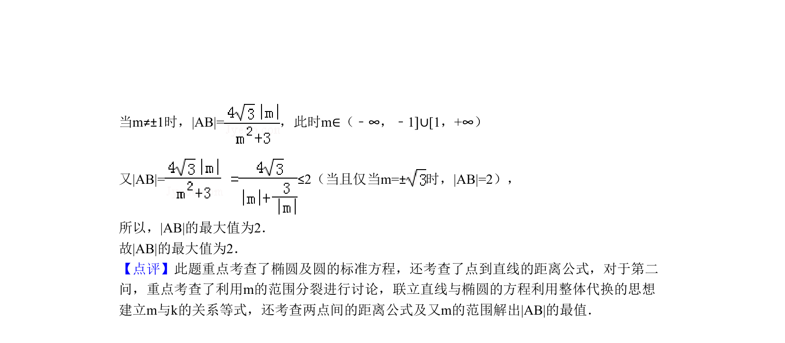

## 题面

## 摘要

椭圆与圆的综合问题，求椭圆焦点、离心率，并探讨切线所截弦长的函数关系与最值。

## 关联考点

- [[061-方程|椭圆的标准方程]]
- [[391-椭圆离心率|离心率]]
- [[1004-直线与圆相切|直线与圆相切]]
- [[867-弦长公式|弦长公式]]
- [[913-最值问题|最值问题]]

## 答案与解析

> 📄 原 PDF 第 13 页：`素材/真题/北京/2008-2024·（北京）数学高考真题/2011年高考数学试卷（理）（北京）（解析卷）.pdf`
