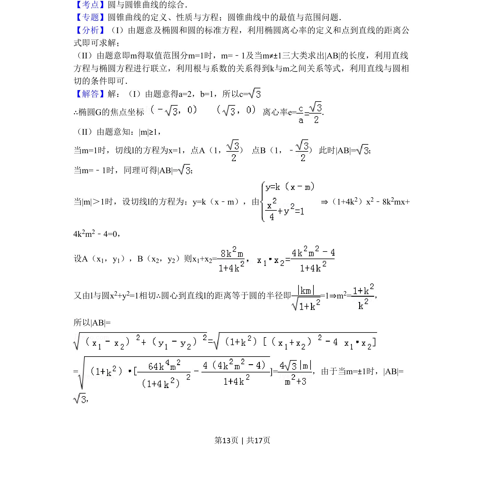
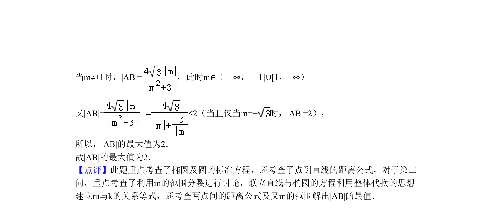

## 题面

## 摘要

椭圆与圆的综合问题，求椭圆焦点、离心率，并探讨切线所截弦长的函数关系与最值。

## 关联考点

- [[061-方程|椭圆的标准方程]]
- [[391-椭圆离心率|离心率]]
- [[1004-直线与圆相切|直线与圆相切]]
- [[867-弦长公式|弦长公式]]
- [[913-最值问题|最值问题]]

## 答案与解析

> 📄 原 PDF 第 13 页：`素材/真题/北京/2008-2024·（北京）数学高考真题/2011年高考数学试卷（理）（北京）（解析卷）.pdf`

<!-- 题干文本-start -->
## 题干文本
19．（14分）（2011•北京）已知椭圆 ．过点（m，0）作圆x 2+y2=1的切线I
交椭圆G于A，B两点．
（Ⅰ）求椭圆G的焦点坐标和离心率；
（Ⅱ）将|AB|表示为m的函数，并求|AB|的最大值．
<!-- 题干文本-end -->

<!-- 解析文本-start -->
## 解析文本
【考点】圆与圆锥曲线的综合．菁优网版权所有
【专题】圆锥曲线的定义、性质与方程；圆锥曲线中的最值与范围问题．
【分析】（I）由题意及椭圆和圆的标准方程，利用椭圆离心率的定义和点到直线的距离公
式即可求解；
（II）由题意即m得取值范围分m=1时，m=﹣1及当m≠±1三大类求出|AB|的长度，利用直线
方程与椭圆方程进行联立，利用根与系数的关系得到k与m之间关系等式，利用直线与圆相
切的条件即可．
【解答】解：（I）由题意得a=2，b=1，所以c=
∴椭圆G的焦点坐标 离心率e=．
（II）由题意知：|m|≥1，
当m=1时，切线l的方程为x=1，点A（1， ）  点B（1，﹣） 此时|AB|=；
当m=﹣1时，同理可得|AB|=；
当|m|＞1时，设切线l的方程为：y=k（x﹣m），由⇒（1+4k 2）x2﹣8k2mx+
4k2m2﹣4=0，
设A（x1，y1），B（x2，y2）则x1+x2=
又由l与圆x2+y2=1相切∴圆心到直线l的距离等于圆的半径即=1⇒m 2=，
所以|AB|=
=]=，由于当m=±1时，|AB|=
，
<!-- 解析文本-end -->
