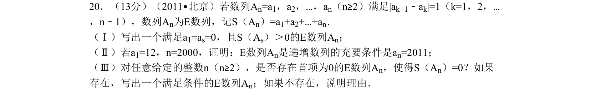
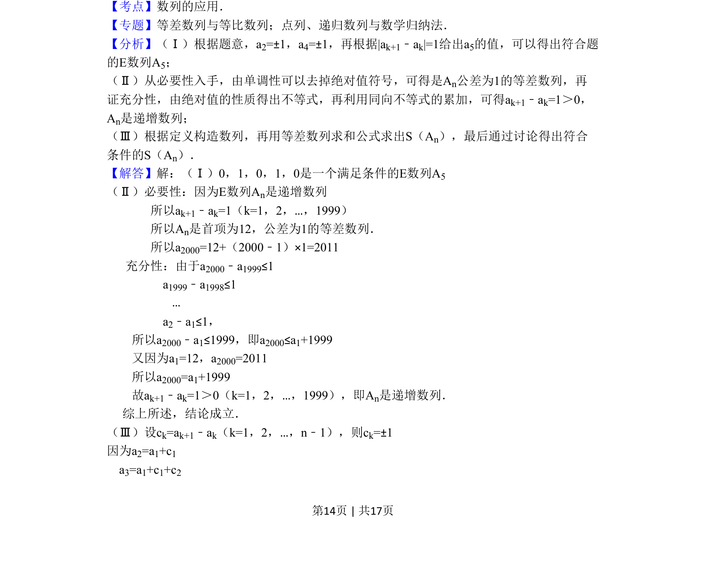
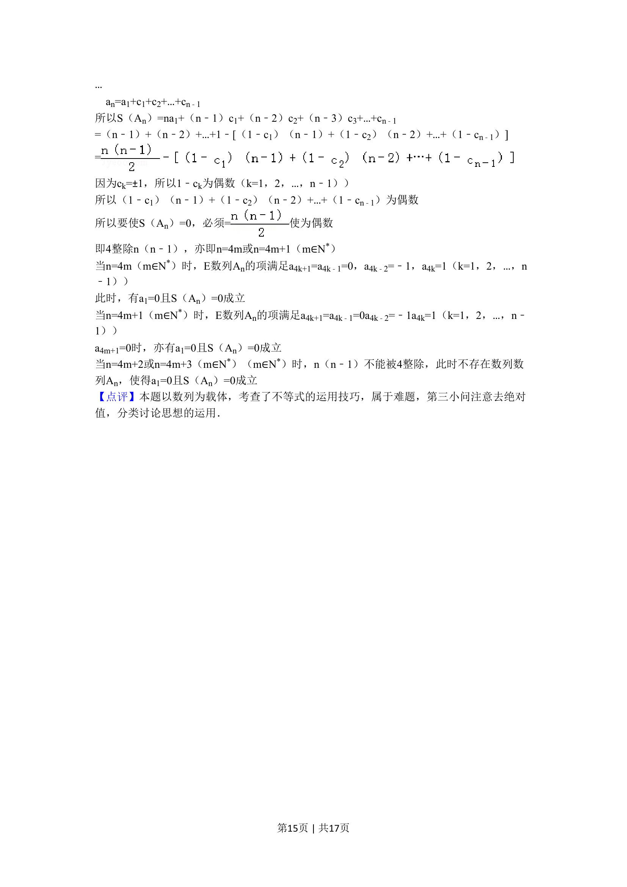
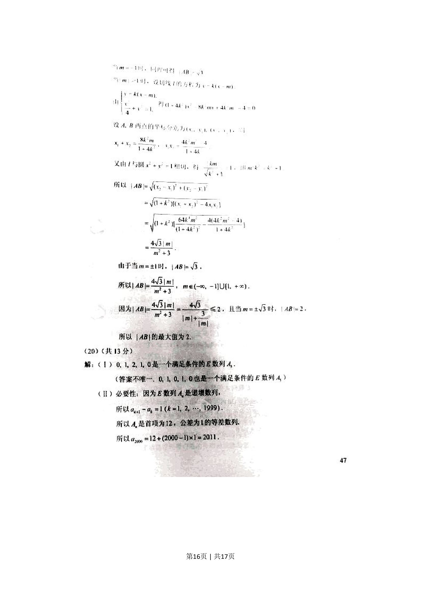
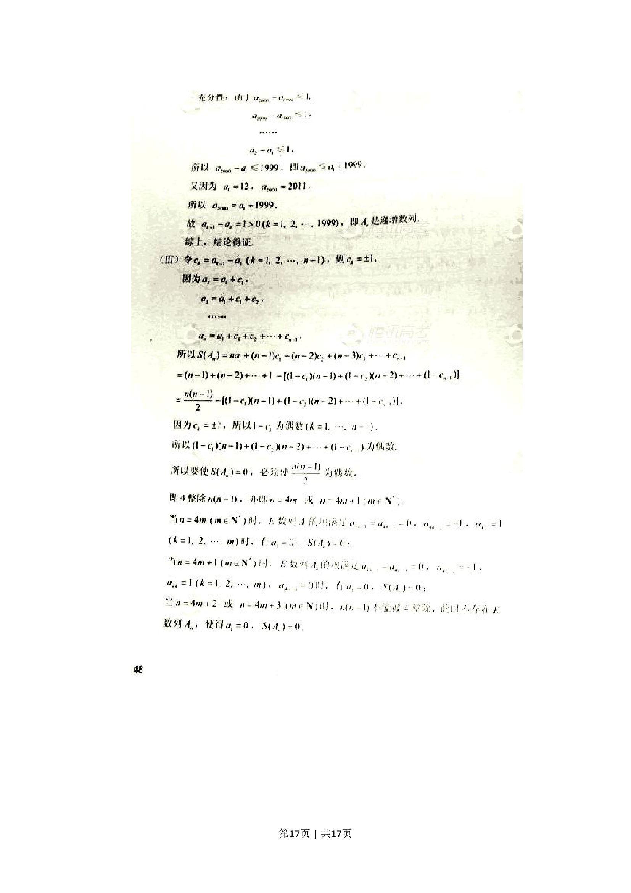

## 题面

## 摘要

一道自定义E数列的综合题，涉及数列构造、单调性证明及充要条件探究

## 关联考点

- [[459-数列的应用|数列的应用]]
- [[356-等差数列概念|等差数列]]
- [[533-充分必要条件|充分必要条件]]
- [[383-数列递推公式|递推关系]]

## 答案与解析

> 📄 原 PDF 第 14 页：`素材/真题/北京/2008-2024·（北京）数学高考真题/2011年高考数学试卷（理）（北京）（解析卷）.pdf`
