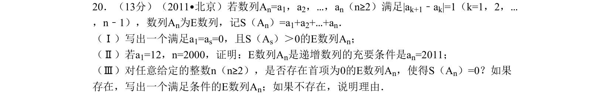
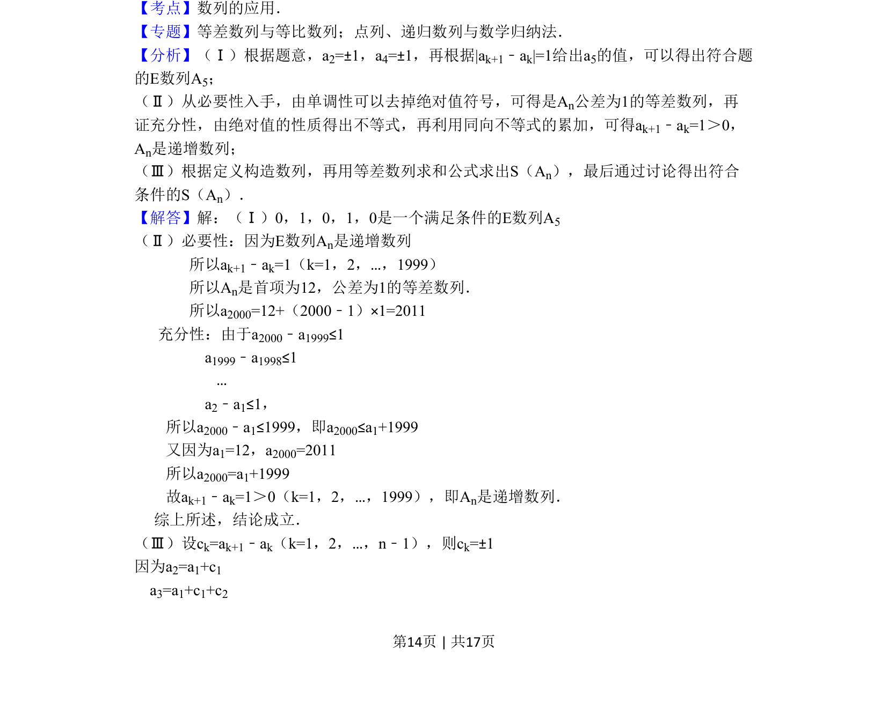
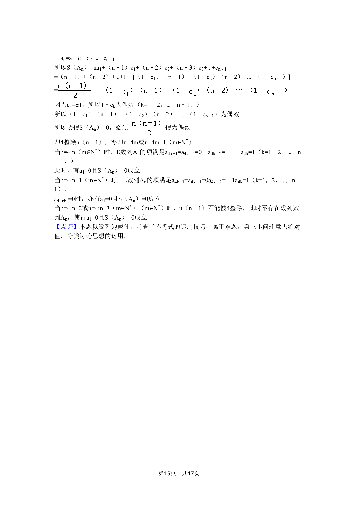
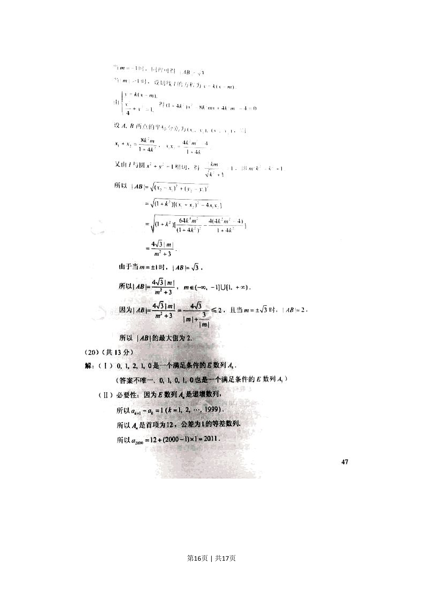
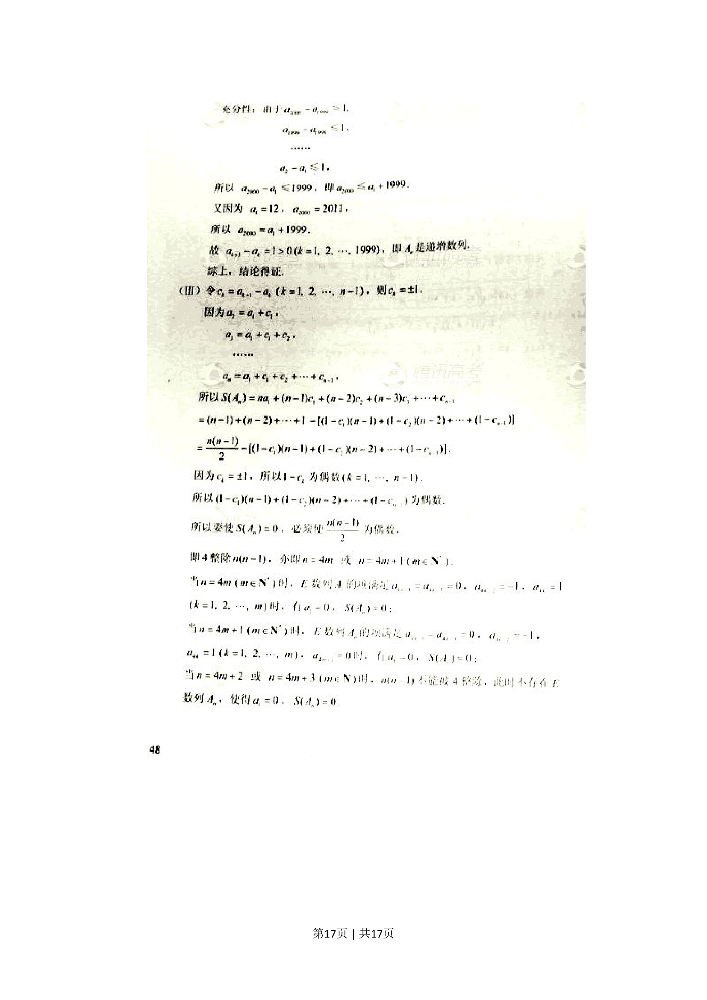

## 题面

## 摘要

一道自定义E数列的综合题，涉及数列构造、单调性证明及充要条件探究

## 关联考点

- [[459-数列的应用|数列的应用]]
- [[356-等差数列概念|等差数列]]
- [[533-充分必要条件|充分必要条件]]
- [[383-数列递推公式|递推关系]]

## 答案与解析

> 📄 原 PDF 第 14 页：`素材/真题/北京/2008-2024·（北京）数学高考真题/2011年高考数学试卷（理）（北京）（解析卷）.pdf`

<!-- 题干文本-start -->
## 题干文本
20．（13分）（2011•北京）若数列An=a1，a2，…，an（n≥2）满足|ak+1﹣ak|=1（k=1，2，…
，n﹣1），数列An为E数列，记S（An）=a1+a2+…+an．
（Ⅰ）写出一个满足a1=as=0，且S（As）＞0的E数列An；
（Ⅱ）若a1=12，n=2000，证明：E数列An是递增数列的充要条件是an=2011；
（Ⅲ）对任意给定的整数n（n≥2），是否存在首项为0的E数列An，使得S（An）=0？如果
存在，写出一个满足条件的E数列An；如果不存在，说明理由．
<!-- 题干文本-end -->

<!-- 解析文本-start -->
## 解析文本
【考点】数列的应用．菁优网版权所有
【专题】等差数列与等比数列；点列、递归数列与数学归纳法．
【分析】（Ⅰ）根据题意，a2=±1，a4=±1，再根据|ak+1﹣ak|=1给出a5的值，可以得出符合题
的E数列A5；
（Ⅱ）从必要性入手，由单调性可以去掉绝对值符号，可得是An公差为1的等差数列，再
证充分性，由绝对值的性质得出不等式，再利用同向不等式的累加，可得ak+1﹣ak=1＞0，
An是递增数列；
（Ⅲ）根据定义构造数列，再用等差数列求和公式求出S（An），最后通过讨论得出符合
条件的S（An）．
【解答】解：（Ⅰ）0，1，0，1，0是一个满足条件的E数列A5
（Ⅱ）必要性：因为E数列An是递增数列
              所以ak+1﹣ak=1（k=1，2，…，1999）
              所以An是首项为12，公差为1的等差数列．
              所以a2000=12+（2000﹣1）×1=2011
      充分性：由于a2000﹣a1999≤1
                  a1999﹣a1998≤1
                     …
                  a2﹣a1≤1，
        所以a2000﹣a1≤1999，即a2000≤a1+1999
        又因为a1=12，a2000=2011
        所以a2000=a1+1999
        故ak+1﹣ak=1＞0（k=1，2，…，1999），即An是递增数列．
     综上所述，结论成立．
（Ⅲ）设ck=ak+1﹣ak（k=1，2，…，n﹣1），则ck=±1
因为a2=a1+c1
    a3=a1+c1+c2
<!-- 解析文本-end -->
