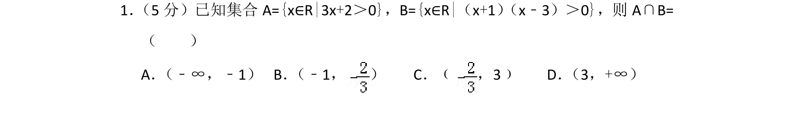
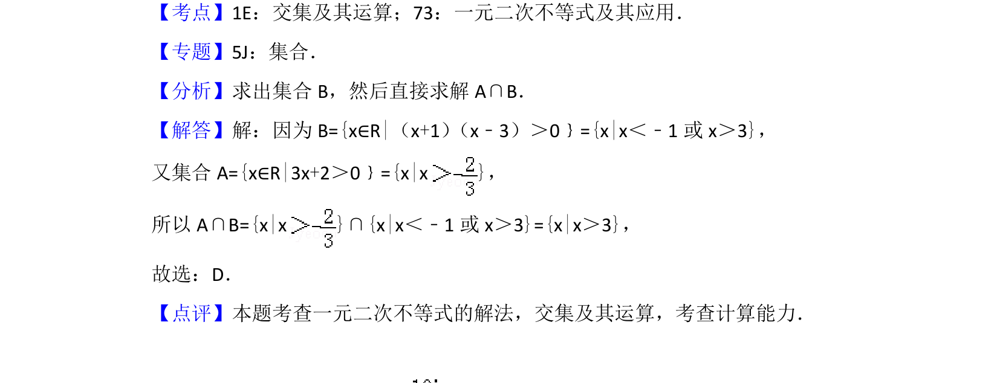

## 题面

## 摘要

本题通过求解一元一次和一元二次不等式，求集合的交集。

## 关联考点

- [[645-交集及其运算|交集及其运算]]
- [[1363-一元二次不等式及其应用|一元二次不等式及其应用]]
- [[1140-集合的表示法|集合的表示法]]

## 答案与解析

> 📄 原 PDF 第 1 页：`素材/真题/北京/2008-2024·（北京）数学高考真题/2012年高考数学试卷（文）（北京）（解析卷）.pdf`
