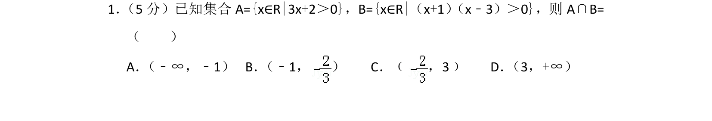
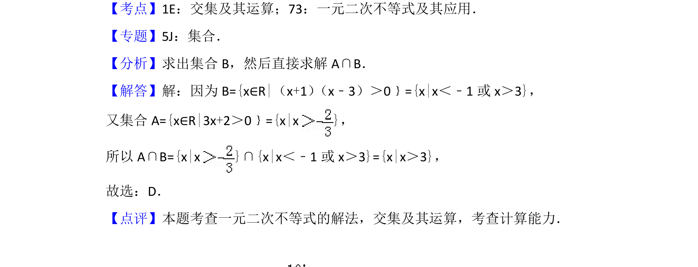

## 题面

## 摘要

本题通过求解一元一次和一元二次不等式，求集合的交集。

## 关联考点

- [[645-交集及其运算|交集及其运算]]
- [[1363-一元二次不等式及其应用|一元二次不等式及其应用]]
- [[1140-集合的表示法|集合的表示法]]

## 答案与解析

> 📄 原 PDF 第 1 页：`素材/真题/北京/2008-2024·（北京）数学高考真题/2012年高考数学试卷（文）（北京）（解析卷）.pdf`

<!-- 题干文本-start -->
## 题干文本
1． （5分）已知集合A={x∈R|3x+2＞0}，B={x∈R|（x+1） （x﹣3）＞0}，则A∩B=
（　　）
A． （﹣∞，﹣1）B． （﹣1， ）C．﹙，3﹚D． （3，+∞）
<!-- 题干文本-end -->

<!-- 解析文本-start -->
## 解析文本
【考点】1E：交集及其运算；73：一元二次不等式及其应用．菁优网版权所有
【专题】5J：集合．
【分析】求出集合B，然后直接求解A∩B．
【解答】解：因为B={x∈R|（x+1） （x﹣3）＞0﹜={x|x＜﹣1或x＞3}，
又集合A={x∈R|3x+2＞0﹜={x|x}，
所以A∩B={x|x}∩{x|x＜﹣1或x＞3}={x|x＞3}，
故选：D．
【点评】本题考查一元二次不等式的解法，交集及其运算，考查计算能力．
<!-- 解析文本-end -->
