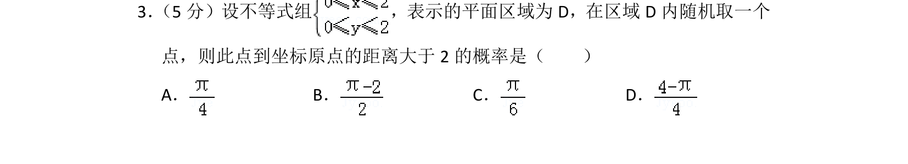
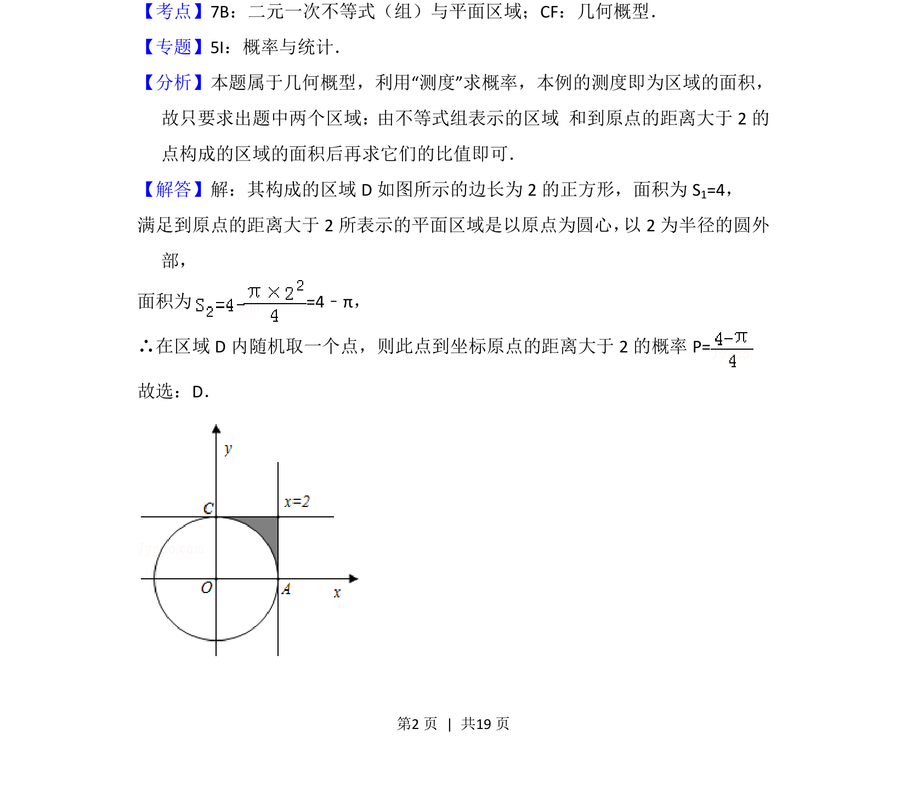

## 题面

## 摘要

在不等式组表示的平面区域内求解点到原点距离大于2的概率，属于几何概型。

## 关联考点

- [[1366-二元一次不等式组与平面区域|二元一次不等式组与平面区域]]
- [[667-几何概型|几何概型]]

## 答案与解析

> 📄 原 PDF 第 2 页：`素材/真题/北京/2008-2024·（北京）数学高考真题/2012年高考数学试卷（文）（北京）（解析卷）.pdf`

<!-- 题干文本-start -->
## 题干文本
3． （5分）设不等式组 ，表示的平面区域为D，在区域D内随机取一个
点，则此点到坐标原点的距离大于2的概率是（　　）
A．B．C．D．
<!-- 题干文本-end -->

<!-- 解析文本-start -->
## 解析文本
【考点】7B：二元一次不等式（组）与平面区域；CF：几何概型．菁优网版权所有
【专题】5I：概率与统计．
【分析】本题属于几何概型，利用“测度”求概率，本例的测度即为区域的面积，
故只要求出题中两个区域：由不等式组表示的区域 和到原点的距离大于2的
点构成的区域的面积后再求它们的比值即可．
【解答】解：其构成的区域D如图所示的边长为2的正方形，面积为S 1=4，
满足到原点的距离大于2所表示的平面区域是以原点为圆心， 以2为半径的圆外
部，
面积为=4﹣π，
∴在区域D内随机取一个点，则此点到坐标原点的距离大于2的概率P=
故选：D．
<!-- 解析文本-end -->
