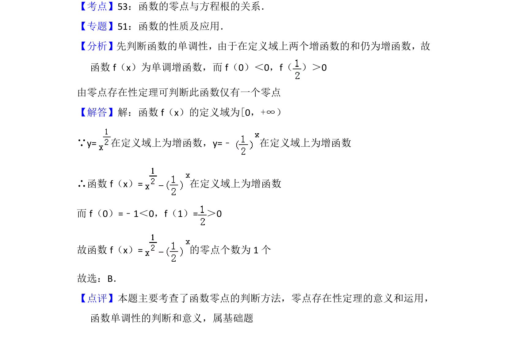

## 题面

## 摘要

求函数零点的个数，涉及指数函数与幂函数的交点问题。

## 关联考点

- [[288-函数零点|函数零点]]
- [[304-指数函数|指数函数]]
- [[302-幂函数|幂函数]]
- [[897-数形结合|数形结合]]

## 答案与解析

> 📄 原 PDF 第 3 页：`素材/真题/北京/2008-2024·（北京）数学高考真题/2012年高考数学试卷（文）（北京）（解析卷）.pdf`
