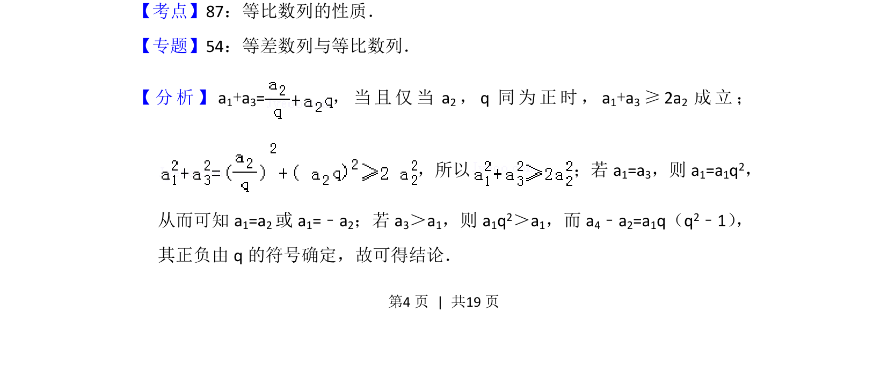
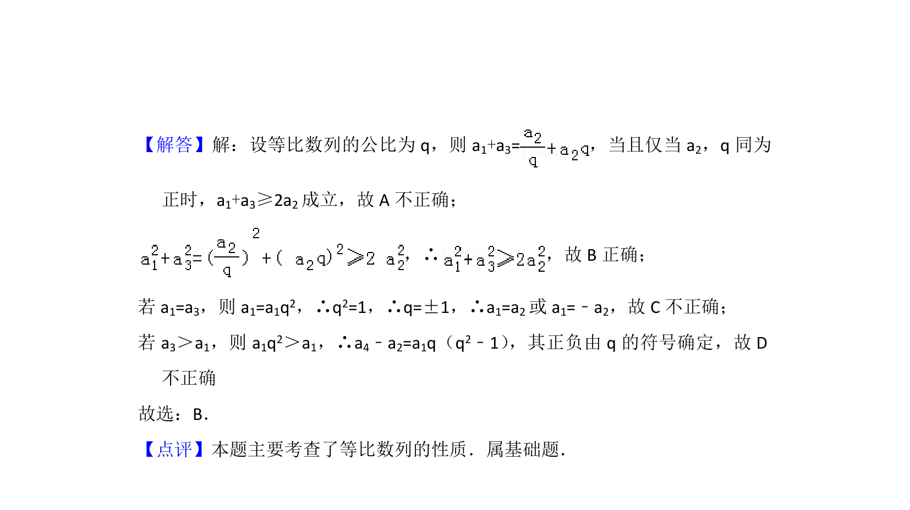

## 题面

## 摘要

本题通过等比数列的通项与性质，结合均值不等式及逻辑判断，考查选项真伪的辨析能力。

## 关联考点

- [[1068-等比数列的性质|等比数列的性质]]
- [[295-基本不等式|均值不等式]]
- [[037-推理|逻辑推理]]

## 答案与解析

> 📄 原 PDF 第 4 页：`素材/真题/北京/2008-2024·（北京）数学高考真题/2012年高考数学试卷（文）（北京）（解析卷）.pdf`
