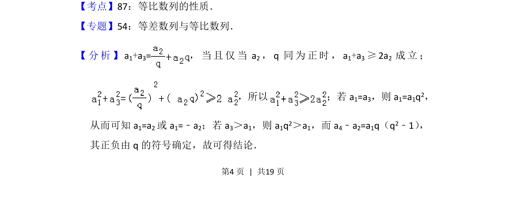
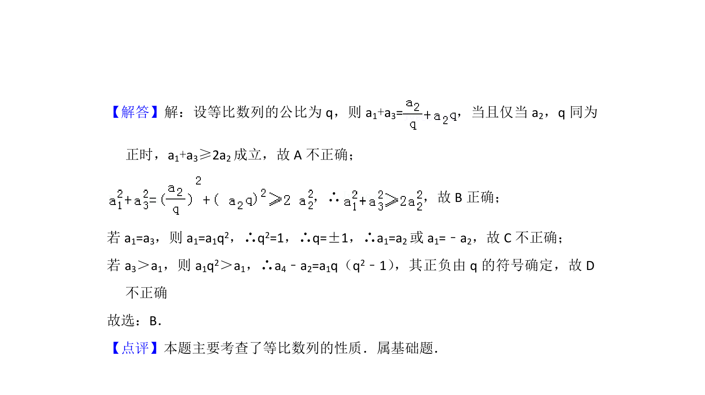

## 题面

## 摘要

本题通过等比数列的通项与性质，结合均值不等式及逻辑判断，考查选项真伪的辨析能力。

## 关联考点

- [[413-等比数列性质|等比数列的性质]]
- [[295-基本不等式|均值不等式]]
- [[037-推理|逻辑推理]]

## 答案与解析

> 📄 原 PDF 第 4 页：`素材/真题/北京/2008-2024·（北京）数学高考真题/2012年高考数学试卷（文）（北京）（解析卷）.pdf`

<!-- 题干文本-start -->
## 题干文本
6． （5分）已知{an}为等比数列，下面结论中正确的是（　　）
A．a1+a3≥2a2 B．a12+a32≥2a22
C．若a 1=a3，则a 1=a2 D．若a 3＞a1，则a 4＞a2
<!-- 题干文本-end -->

<!-- 解析文本-start -->
## 解析文本
【考点】87：等比数列的性质．菁优网版权所有
【专题】54：等差数列与等比数列．
【分析】a 1+a3=，当且仅当a 2，q同为正时，a 1+a3≥2a 2 成立；
，所以 ；若a 1=a3，则a 1=a1q2，
从而可知a 1=a2或a 1=﹣a2；若a 3＞a1，则a 1q2＞a1，而a 4﹣a2=a1q（q2﹣1） ，
其正负由q的符号确定，故可得结论．
<!-- 解析文本-end -->
