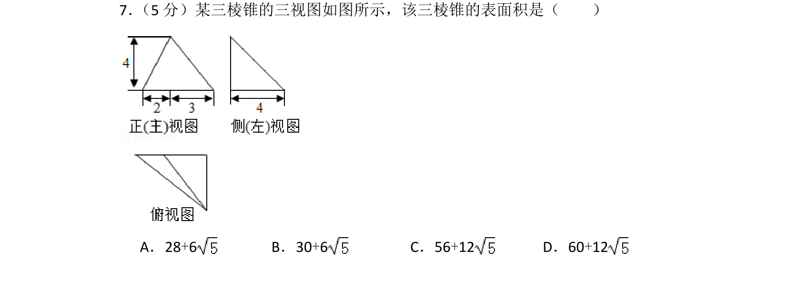
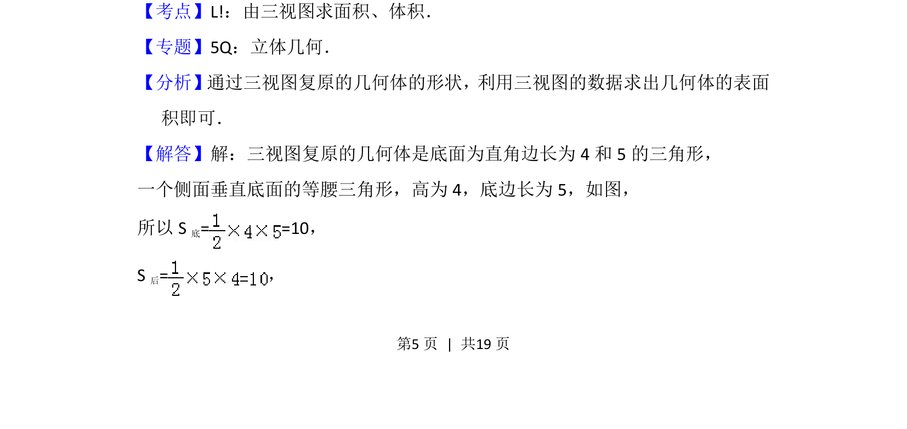
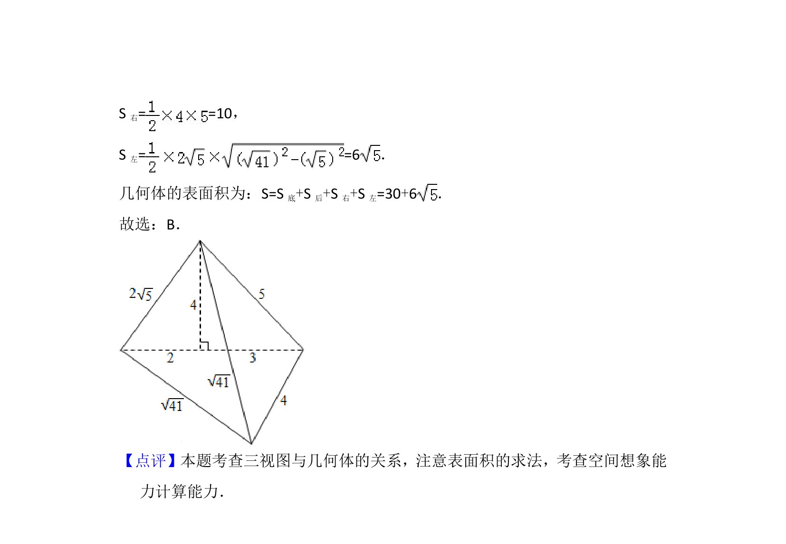

## 题面

## 摘要

通过三视图还原三棱锥，计算其表面积

## 关联考点

- [[1198-由三视图求面积|由三视图求面积]]
- [[066-体积|体积]]
- [[三棱锥表面积]]
- [[1045-空间几何体|空间几何体]]

## 答案与解析

> 📄 原 PDF 第 5 页：`素材/真题/北京/2008-2024·（北京）数学高考真题/2012年高考数学试卷（文）（北京）（解析卷）.pdf`
