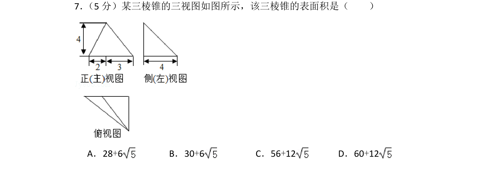
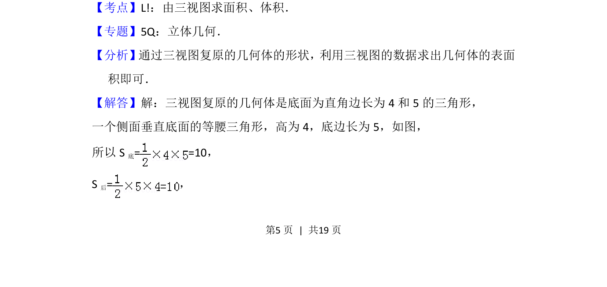
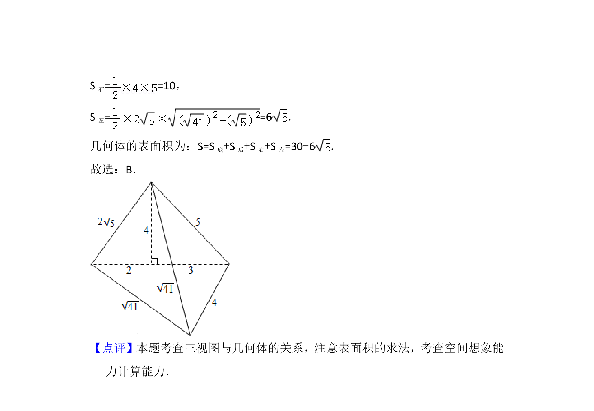

## 题面

## 摘要

通过三视图还原三棱锥，计算其表面积

## 关联考点

- [[1198-由三视图求面积|由三视图求面积]]
- [[066-体积|体积]]
- [[三棱锥表面积]]
- [[1045-空间几何体|空间几何体]]

## 答案与解析

> 📄 原 PDF 第 5 页：`素材/真题/北京/2008-2024·（北京）数学高考真题/2012年高考数学试卷（文）（北京）（解析卷）.pdf`

<!-- 题干文本-start -->
## 题干文本
7． （5分）某三棱锥的三视图如图所示，该三棱锥的表面积是（　　）
A．28+6 B．30+6 C．56+12 D．60+12
<!-- 题干文本-end -->

<!-- 解析文本-start -->
## 解析文本
【考点】L!：由三视图求面积、体积．菁优网版权所有
【专题】5Q：立体几何．
【分析】通过三视图复原的几何体的形状，利用三视图的数据求出几何体的表面
积即可．
【解答】解：三视图复原的几何体是底面为直角边长为4和5的三角形，
一个侧面垂直底面的等腰三角形，高为4，底边长为5，如图，
所以S 底= =10，
S 后=，
<!-- 解析文本-end -->
