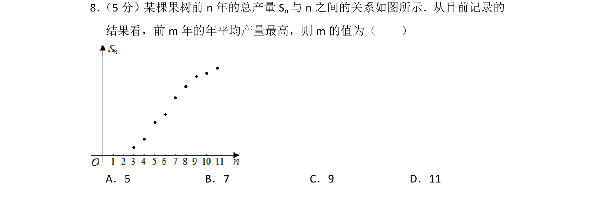
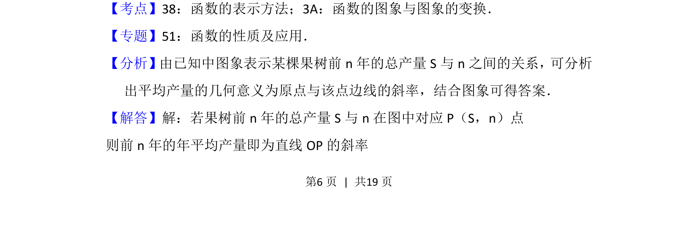
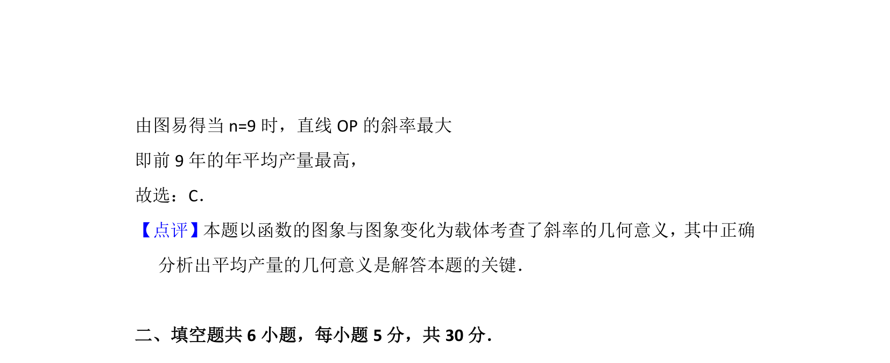

## 题面

## 摘要

考查通过函数图象分析年平均产量最大值，将问题转化为原点与点连线的斜率比较。

## 关联考点

- [[函数的图象]]
- [[393-直线倾斜角与斜率|斜率]]
- [[1405-几何意义|几何意义]]

## 答案与解析

> 📄 原 PDF 第 6 页：`素材/真题/北京/2008-2024·（北京）数学高考真题/2012年高考数学试卷（文）（北京）（解析卷）.pdf`
