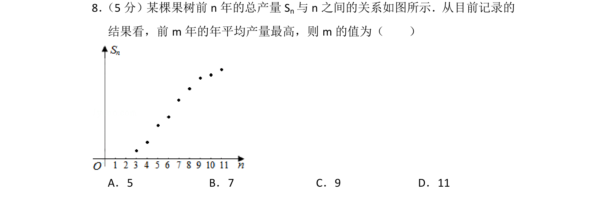
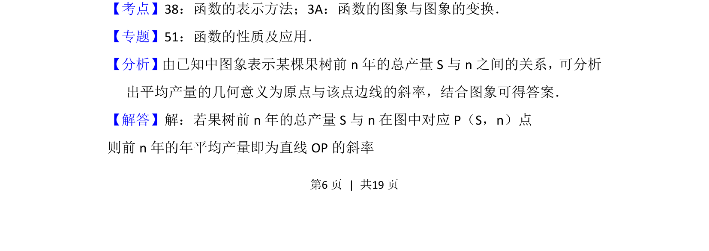
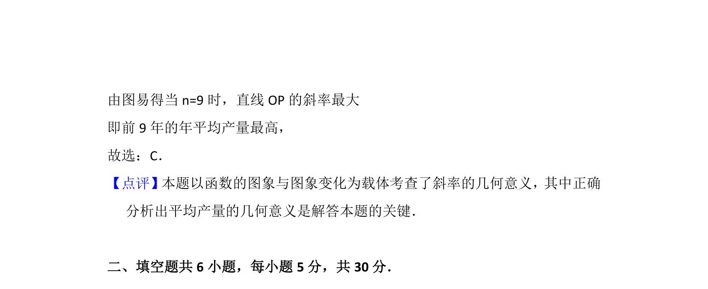

## 题面

## 摘要

考查通过函数图象分析年平均产量最大值，将问题转化为原点与点连线的斜率比较。

## 关联考点

- [[函数的图象]]
- [[393-直线倾斜角与斜率|斜率]]
- [[1405-几何意义|几何意义]]

## 答案与解析

> 📄 原 PDF 第 6 页：`素材/真题/北京/2008-2024·（北京）数学高考真题/2012年高考数学试卷（文）（北京）（解析卷）.pdf`

<!-- 题干文本-start -->
## 题干文本
8． （5分）某棵果树前n年的总产量Sn与n之间的关系如图所示．从目前记录的
结果看，前m年的年平均产量最高，则m的值为（　　）
A．5 B．7 C．9 D．11
<!-- 题干文本-end -->

<!-- 解析文本-start -->
## 解析文本
【考点】38：函数的表示方法；3A：函数的图象与图象的变换．菁优网版权所有
【专题】51：函数的性质及应用．
【分析】由已知中图象表示某棵果树前n年的总产量S与n之间的关系，可分析
出平均产量的几何意义为原点与该点边线的斜率，结合图象可得答案．
【解答】解：若果树前n年的总产量S与n在图中对应P（S，n）点
则前n年的年平均产量即为直线OP的斜率
<!-- 解析文本-end -->
