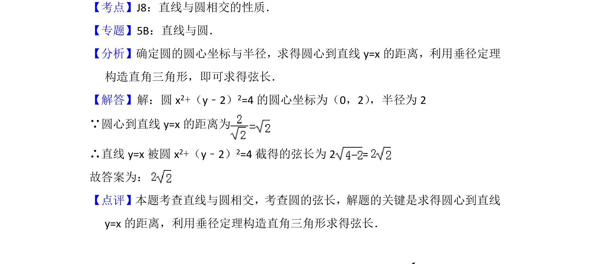

## 题面

## 摘要

求直线被圆所截弦长，利用圆心到直线距离与垂径定理计算。

## 关联考点

- [[1219-直线与圆相交|直线与圆相交]]
- [[867-弦长|弦长]]
- [[224-垂径定理|垂径定理]]
- [[1212-点到直线距离|点到直线距离]]

## 答案与解析

> 📄 原 PDF 第 7 页：`素材/真题/北京/2008-2024·（北京）数学高考真题/2012年高考数学试卷（文）（北京）（解析卷）.pdf`
