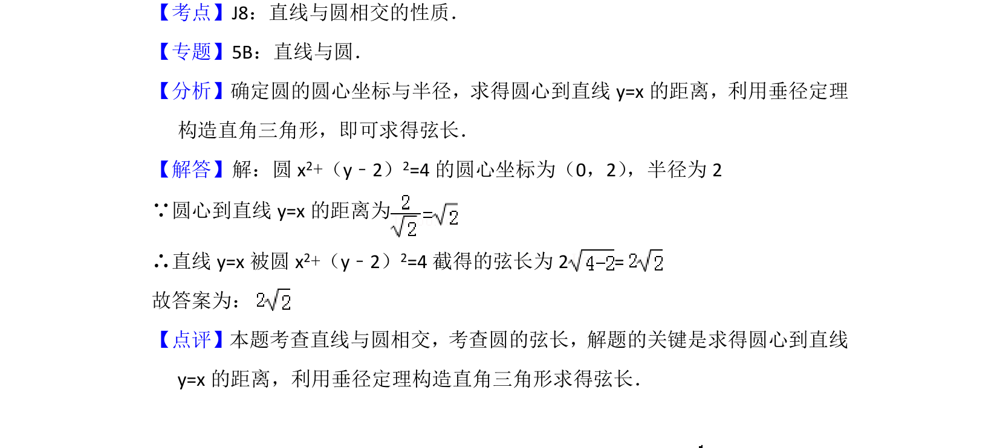

## 题面

## 摘要

求直线被圆所截弦长，利用圆心到直线距离与垂径定理计算。

## 关联考点

- [[1218-直线与圆相交|直线与圆相交]]
- [[866-弦长|弦长]]
- [[224-垂径定理|垂径定理]]
- [[1211-点到直线距离|点到直线距离]]

## 答案与解析

> 📄 原 PDF 第 7 页：`素材/真题/北京/2008-2024·（北京）数学高考真题/2012年高考数学试卷（文）（北京）（解析卷）.pdf`

<!-- 题干文本-start -->
## 题干文本
9． （5分）直线y=x被圆x2+（y﹣2）2=4截得的弦长为　 　．
<!-- 题干文本-end -->

<!-- 解析文本-start -->
## 解析文本
【考点】J8：直线与圆相交的性质．菁优网版权所有
【专题】5B：直线与圆．
【分析】确定圆的圆心坐标与半径，求得圆心到直线y=x的距离，利用垂径定理
构造直角三角形，即可求得弦长．
【解答】解：圆x 2+（y﹣2）2=4的圆心坐标为（0，2） ，半径为2
∵圆心到直线y=x的距离为
∴直线y=x被圆x 2+（y﹣2）2=4截得的弦长为2 =
故答案为：
【点评】 本题考查直线与圆相交， 考查圆的弦长， 解题的关键是求得圆心到直线
y=x的距离，利用垂径定理构造直角三角形求得弦长．
<!-- 解析文本-end -->
