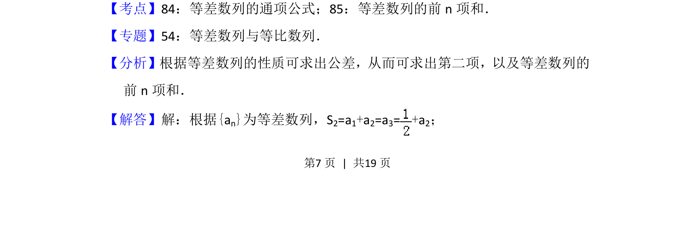
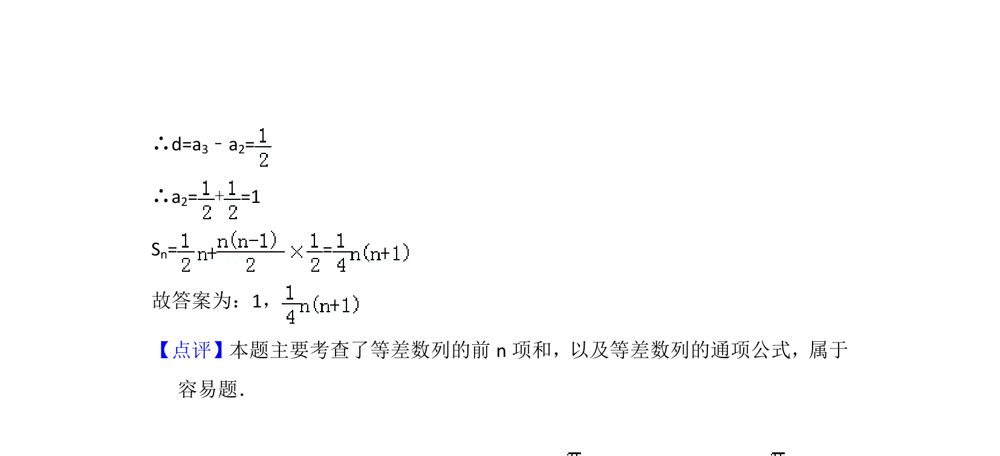

## 题面

## 摘要

已知等差数列首项及前两项和与第三项的关系，求第二项与前 n 项和。

## 关联考点

- [[1063-等差数列通项公式|等差数列的通项公式]]
- [[355-等差数列前n项和|等差数列的前n项和]]

## 答案与解析

> 📄 原 PDF 第 7 页：`素材/真题/北京/2008-2024·（北京）数学高考真题/2012年高考数学试卷（文）（北京）（解析卷）.pdf`

<!-- 题干文本-start -->
## 题干文本
10． （5分）已知{an}为等差数列，S n为其前n项和，若a 1=，S 2=a3，则a 2=　
1　，Sn=　 　．
<!-- 题干文本-end -->

<!-- 解析文本-start -->
## 解析文本
【考点】84：等差数列的通项公式；85：等差数列的前n项和．菁优网版权所有
【专题】54：等差数列与等比数列．
【分析】根据等差数列的性质可求出公差，从而可求出第二项，以及等差数列的
前n项和．
【解答】解：根据{an}为等差数列，S2=a1+a2=a3=+a 2；
<!-- 解析文本-end -->
