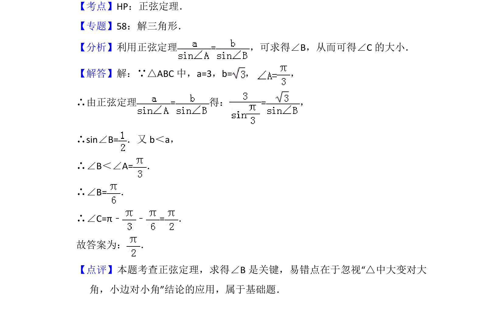

## 题面

## 摘要

在三角形中已知两边及一角，利用正弦定理求另一角，并注意边角关系。

## 关联考点

- [[126-定理|正弦定理]]
- [[589-解三角形|解三角形]]

## 答案与解析

> 📄 原 PDF 第 8 页：`素材/真题/北京/2008-2024·（北京）数学高考真题/2012年高考数学试卷（文）（北京）（解析卷）.pdf`

<!-- 题干文本-start -->
## 题干文本
11． （5分）在△ABC中，若a=3，b=， ，则∠C的大小为　 　．
<!-- 题干文本-end -->

<!-- 解析文本-start -->
## 解析文本
【考点】HP：正弦定理．菁优网版权所有
【专题】58：解三角形．
【分析】利用正弦定理=，可求得∠B，从而可得∠C的大小．
【解答】解：∵△ABC中，a=3，b=， ，
∴由正弦定理=得：=，
∴sin∠B=．又b＜a，
∴∠B＜∠A=．
∴∠B=．
∴∠C=π﹣ ﹣=．
故答案为： ．
【点评】本题考查正弦定理，求得∠B是关键，易错点在于忽视“△中大变对大
角，小边对小角”结论的应用，属于基础题．
<!-- 解析文本-end -->
