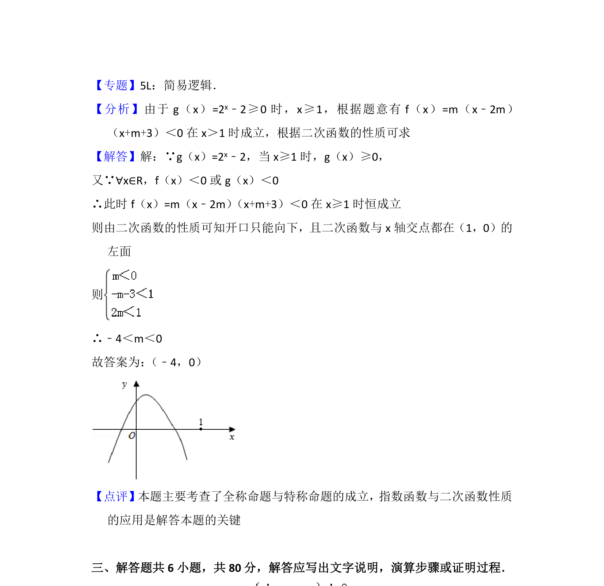

## 题面

## 摘要

已知含参二次函数与指数函数，通过全称命题的真假条件求参数取值范围。

## 关联考点

- [[复合命题及其真假]]
- [[全称量词和全称命题]]
- [[212-二次函数定义|二次函数]]
- [[304-指数函数|指数函数]]

## 答案与解析

> 📄 原 PDF 第 9 页：`素材/真题/北京/2008-2024·（北京）数学高考真题/2012年高考数学试卷（文）（北京）（解析卷）.pdf`
