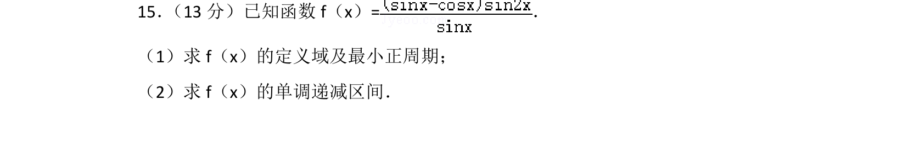
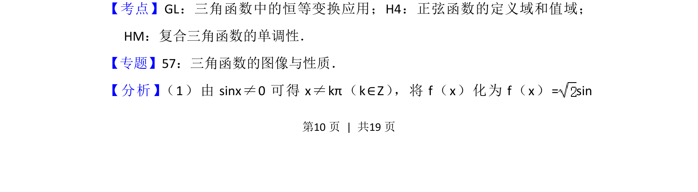
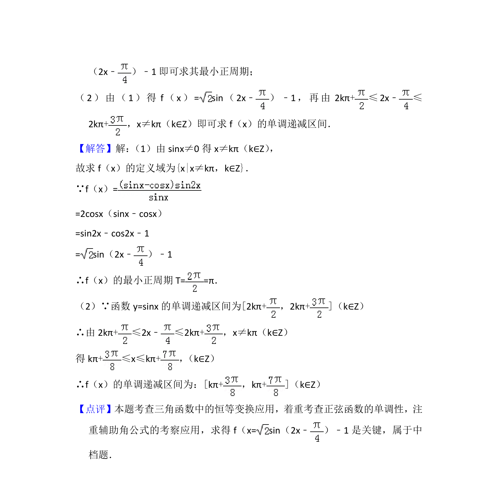

## 题面

## 摘要

求三角函数定义域、最小正周期及单调递减区间，涉及恒等变换与正弦函数性质。

## 关联考点

- [[1248-三角函数恒等变换|三角函数恒等变换]]
- [[正弦函数定义域]]
- [[复合三角函数单调性]]

## 答案与解析

> 📄 原 PDF 第 10 页：`素材/真题/北京/2008-2024·（北京）数学高考真题/2012年高考数学试卷（文）（北京）（解析卷）.pdf`
